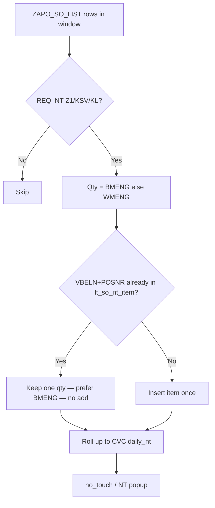

# ZGATPDB — Credit-block order NT duplicated after release/confirm (47 instead of 31)

**System:** DEVSCMAD1 (`ZAPO_GATP_ALLOCATION_F005` — last verified live source; AD1 MCP offline at write time)  
**Program:** `ZAPO_GATP_ALLOCATION_REPORT` / **T-code:** `ZGATPDB`  
**Param:** `NT_MT_NEW` / `REPORT_NEW`  
**Popup:** gATP Manual & NO Touch Report — **NT (Plant)**  
**Tables:** `ZAPO_SO_LIST`  
**Version:** 1.0 — 24/07/2026  

---

## 1. Symptom (screenshot)

| Metric | Value |
|--------|--------|
| **MT (Plant)** PMR / PP | **15** (correct) |
| **NT (Plant)** PMR / PP | **47** ✗ |
| **Expected NT (Plant)** | **31** |

**Math**

```text
47 = 15 (other KL/NT order)
   + 16 (credit-block order — first count while CMGST = B)
   + 16 (same order counted again after CMGST cleared & confirmed)

31 = 15 + 16   ← correct (count the CB order once only)
```

| Step | Credit block | Expected NT contribution of that order |
|------|--------------|----------------------------------------|
| 1 | **`CMGST = 'B'`** — allocation / dashboard | **16** once ✓ |
| 2 | **`B` removed** — order released & confirmed | Still **16** once — **not** +16 again |

**Rule:** Quantity already considered in the NT dashboard while credit-blocked must **not** be duplicated in the popup after confirmation.

---

## 2. Root cause

### 2.1 NT popup (new param) = grid `no_touch` from `lt_so_daily_nt_sum`

In `get_gatprep_data` (~7219), new param **does not** add `gw_apo_so_nt_*`. Popup NT comes from selected-row **`no_touch`**.

`no_touch` is set in CHANGE F from:

```abap
lv_net_nt = ls_so_daily_nt_sum-daily_nt - lv_saved_nt.
<fs_output>-no_touch = lv_net_nt.
```

So **47 is already inside `lt_so_daily_nt_sum`** (or the sum of selected rows built from it).

### 2.2 Daily NT collects every `ZAPO_SO_LIST` line independently (~839)

```abap
IF lw_so_all-edatu >= sy-datum
AND lw_so_all-edatu <= lv_so_nt_edatu_high
AND ( req_nt = 'Z1' OR 'KSV' OR 'KL' ).
  IF lw_so_all-bmeng > 0.
    ls_so_daily_nt_sum-daily_nt = lw_so_all-bmeng.
  ELSE.
    ls_so_daily_nt_sum-daily_nt = lw_so_all-wmeng.
  ENDIF.
  COLLECT ls_so_daily_nt_sum INTO lt_so_daily_nt_sum.  " key = CVC only
ENDIF.
```

**COLLECT key = CVC** (`gccode/matnr/werks/vtweg/spart`) — **not** `VBELN`/`POSNR`/`ETENR`.

| While `CMGST = 'B'` (often unconfirmed) | After credit clear + confirm |
|----------------------------------------|------------------------------|
| One open line: `WMENG = 16`, `BMENG = 0` → NT **+16** | Same demand may appear as **another list row** and/or `BMENG = 16` |
| Dashboard shows **16** correctly | Second COLLECT → NT **+16 again** |

Typical extract patterns after confirmation (any one causes **+16** duplicate):

1. **Two schedule lines (`ETENR`)** for same item — both still `DELIND = space`, each contributing 16  
2. **Legacy open line** (`BMENG = 0`, `WMENG = 16`) **plus** confirmed line (`BMENG = 16`)  
3. **Replacement / re-extracted SO** after release (old + new `VBELN`) both with `REQ_NT = 'KL'` in the forward window  

`COLLECT` at CVC level **sums both** → `15 + 16 + 16 = 47`.

### 2.3 `get_zapo_so_list` has the same WMENG fallback (safety)

```abap
IF gw_apo_so_list-bmeng = 0 AND lw_so_list_pop-wmeng > 0.
  gw_apo_so_list-bmeng = lw_so_list_pop-wmeng.
ENDIF.
```

If popup path ever adds SO NT (old param / future change), multi-line extract doubles again. Deduplicate there too.

### 2.4 `lt_cb_ord` is **not** the popup double source

Credit block → `lt_cb_ord` adds only to **`inc_ord_quan`**, not to `no_touch`.  
Popup NT double is from **SO daily NT COLLECT**, not from CB→incoming.

---

## 3. Required behaviour

```text
For each sales-order item (VBELN + POSNR):
  NT_qty_item = BMENG if BMENG > 0
                else WMENG
  Count that item ONCE in daily NT (even if multiple ETENR / extract rows)

CVC daily_nt = SUM( NT_qty_item ) over distinct VBELN+POSNR
             in EDATU window / CB-eligible rules
```

| Stage | NT for CB order |
|-------|-----------------|
| `CMGST = B` | 16 (once) |
| After clear + confirm | 16 (once) |
| Other KL/NT | 15 |
| **Popup NT** | **31** |

---

## 4. Code corrections (`ZAPO_GATP_ALLOCATION_F005`)

### 4.1 CHANGE-CB-DEDUP — Aggregate daily NT by `VBELN`+`POSNR` first

**Location:** `get_data` CHANGE C — replace direct `COLLECT` into `lt_so_daily_nt_sum` (~839–861).

**Add types / tables** (near other CHANGE C types):

```abap
TYPES: BEGIN OF lty_so_nt_item,
         vbeln    TYPE vbeln_va,
         posnr    TYPE posnr,
         gccode   TYPE zkungc,
         matnr    TYPE matnr,
         werks    TYPE werks_d,
         vtweg    TYPE vtweg,
         spart    TYPE spart,
         item_nt  TYPE zbmeng,
       END OF lty_so_nt_item.

DATA: lt_so_nt_item TYPE HASHED TABLE OF lty_so_nt_item
                      WITH UNIQUE KEY vbeln posnr,
      ls_so_nt_item TYPE lty_so_nt_item,
      lv_item_nt    TYPE zbmeng.
```

**Inside the loop — when line qualifies for daily NT** (forward window and/or past-EDATU CB branch):

```abap
IF lw_so_all-bmeng > 0.
  lv_item_nt = lw_so_all-bmeng.
ELSE.
  lv_item_nt = lw_so_all-wmeng.
ENDIF.

IF lv_item_nt <= 0.
  CONTINUE.  " skip empty
ENDIF.

READ TABLE lt_so_nt_item ASSIGNING FIELD-SYMBOL(<nt_item>)
  WITH TABLE KEY vbeln = lw_so_all-vbeln
                 posnr = lw_so_all-posnr.

IF sy-subrc = 0.
*--- Same order item already counted (e.g. CB WMENG then confirm BMENG / extra ETENR)
  IF lw_so_all-bmeng > 0 AND <nt_item>-item_nt <> lw_so_all-bmeng.
*--- Prefer confirmed BMENG; do not add WMENG on top
    <nt_item>-item_nt = lw_so_all-bmeng.
  ENDIF.
*--- Else keep existing qty (no duplicate add)
ELSE.
  CLEAR ls_so_nt_item.
  ls_so_nt_item-vbeln   = lw_so_all-vbeln.
  ls_so_nt_item-posnr   = lw_so_all-posnr.
  ls_so_nt_item-gccode  = lw_so_all-gccode.
  ls_so_nt_item-matnr   = lw_so_all-matnr.
  ls_so_nt_item-werks   = lw_so_all-werks.
  ls_so_nt_item-vtweg   = lw_so_all-vtweg.
  READ TABLE gt_matclass INTO gw_matclass
    WITH KEY zgrade = lw_so_all-matnr BINARY SEARCH.
  IF sy-subrc = 0.
    ls_so_nt_item-spart = gw_matclass-zpdi.
  ELSE.
    ls_so_nt_item-spart = lw_so_all-spart.
  ENDIF.
  ls_so_nt_item-item_nt = lv_item_nt.
  INSERT ls_so_nt_item INTO TABLE lt_so_nt_item.
ENDIF.
```

**After the `LOOP AT lt_so_all`**, roll up to CVC:

```abap
REFRESH lt_so_daily_nt_sum.
LOOP AT lt_so_nt_item INTO ls_so_nt_item.
  CLEAR ls_so_daily_nt_sum.
  ls_so_daily_nt_sum-gccode   = ls_so_nt_item-gccode.
  ls_so_daily_nt_sum-matnr    = ls_so_nt_item-matnr.
  ls_so_daily_nt_sum-werks    = ls_so_nt_item-werks.
  ls_so_daily_nt_sum-vtweg    = ls_so_nt_item-vtweg.
  ls_so_daily_nt_sum-spart    = ls_so_nt_item-spart.
  ls_so_daily_nt_sum-daily_nt = ls_so_nt_item-item_nt.
  COLLECT ls_so_daily_nt_sum INTO lt_so_daily_nt_sum.
ENDLOOP.
```

**Effect for screenshot:** CB item contributes **16** once → `daily_nt = 15 + 16 = 31` → popup **NT = 31**.

> **Multi-ETENR with real split confirms:** If business needs `SUM(BMENG)` across different `ETENR` of the same item, change the hash key to `vbeln + posnr + etenr`, then roll up with `COLLECT` to CVC. Still **never** add a `BMENG = 0` / `WMENG` row when any `ETENR` already has `BMENG > 0` for that item.

---

### 4.2 CHANGE-CB-DEDUP-B — Same guard in `get_zapo_so_list` (popup SO path)

**Location:** After building `lt_apo_so_list` / before NT sum loop (~3852 / ~4078).

```abap
DATA: lt_pop_nt_done TYPE HASHED TABLE OF lty_so_nt_item
                       WITH UNIQUE KEY vbeln posnr,
      ls_pop_nt_done TYPE lty_so_nt_item.

LOOP AT lt_apo_so_list_nt INTO lw_apo_so_list_nt.
  IF lw_apo_so_list_nt-bmeng <= 0.
    CONTINUE.
  ENDIF.
  READ TABLE lt_pop_nt_done TRANSPORTING NO FIELDS
    WITH TABLE KEY vbeln = lw_apo_so_list_nt-vbeln
                   posnr = lw_apo_so_list_nt-posnr.
  IF sy-subrc = 0.
    CONTINUE.  " already summed this item
  ENDIF.
  ls_pop_nt_done-vbeln = lw_apo_so_list_nt-vbeln.
  ls_pop_nt_done-posnr = lw_apo_so_list_nt-posnr.
  INSERT ls_pop_nt_done INTO TABLE lt_pop_nt_done.

  " ... existing plant/depot / div add to gw_apo_so_nt_* ...
ENDLOOP.
```

---

### 4.3 CHANGE-CB-DEDUP-C — Optional: ignore `WMENG` when any confirmed line exists for item

Before inserting into `lt_so_nt_item`, if scanning all `lt_so_all` for same `VBELN`/`POSNR`:

```abap
" If any schedule line has BMENG > 0 for this VBELN+POSNR,
" skip lines with BMENG = 0 (prevents WMENG+BMENG double after confirm)
```

Can be a pre-pass:

```abap
DATA: lt_confirmed TYPE HASHED TABLE OF lty_so_nt_item
                     WITH UNIQUE KEY vbeln posnr.

LOOP AT lt_so_all INTO lw_so_all WHERE bmeng > 0.
  INSERT VALUE #( vbeln = lw_so_all-vbeln posnr = lw_so_all-posnr )
    INTO TABLE lt_confirmed.
ENDLOOP.

" When building NT: IF bmeng = 0 AND line in lt_confirmed → SKIP
```

---

### 4.4 Keep prior-backup NT netting

Existing CHANGE F:

```abap
lv_net_nt = ls_so_daily_nt_sum-daily_nt - lv_saved_nt.
```

Still required so yesterday’s backed-up CB NT is not shown again as “new” today. Dedup (§4.1) fixes **same-run / after-confirm** double; backup netting fixes **cross-day** double.

---

## 5. Flow after fix



---

## 6. Test plan

| # | Scenario | Expected NT (Plant) |
|---|----------|---------------------|
| T1 | Other KL **15** + CB order **16** (`CMGST=B`) | **31** |
| T2 | Clear credit + confirm same order; re-run | **31** (not **47**) |
| T3 | SE16 `ZAPO_SO_LIST`: list all `ETENR` for that `VBELN` after confirm | Dedup still **16** for that item |
| T4 | Two **different** orders 16+16 + other 15 | **47** (legitimate) |
| T5 | Backup yesterday with CB 16; clear CB today; no new demand | **0** or new-only (net via `lv_saved_nt`) |
| T6 | MT UA path unchanged | MT still **15** in screenshot case |

**Verification SQL (AD1):**

```sql
-- Find duplicate extract rows for the CB order after confirm
SELECT vbeln, posnr, etenr, edatu, wmeng, bmeng, cmgst, req_nt, delind, abgru
  FROM zapo_so_list
 WHERE req_nt IN ('Z1','KSV','KL')
   AND delind = ' '
   AND abgru  = ' '
   AND edatu BETWEEN sy-datum AND sy-datum + 2
   AND matnr IN ( ... )   -- selection materials
 ORDER BY vbeln, posnr, etenr;
```

Look for **same `VBELN`/`POSNR`** with more than one contributing qty → cause of **+16**.

---

## 7. Transport checklist

| # | Object | Change |
|---|--------|--------|
| 1 | `ZAPO_GATP_ALLOCATION_F005` | §4.1 Item-level dedup before CVC `lt_so_daily_nt_sum` |
| 2 | Same | §4.2 Popup SO NT dedup |
| 3 | Same (optional) | §4.3 Skip WMENG if confirmed BMENG exists |
| 4 | Test | T1 → T2 must go **31** not **47** |

---

## 8. Related MDs

| MD | Topic |
|----|-------|
| `ZGATPDB_CreditBlock_Past_VDATU_NT_Missing_Code_Correction.md` | Past VDATU CB must **appear** in NT |
| `ZGATPDB_GP_UA_NT_DoubleCount_After_BlockClear_Code_Correction.md` | GP/UA → exclude ADB orders from NT |
| `ZGATPDB_Future_EDATU_Backup_Popup_Net_NT_Code_Correction.md` | Net vs prior `ZAPO_PRIME_BCKU` |

**This MD:** After **credit clear + confirm**, same **16 MT** must not inflate NT from **31 → 47**.

---

## 9. Summary

| Question | Answer |
|----------|--------|
| Why NT = **47**? | **15 + 16 + 16** — CB order qty collected **twice** into daily NT |
| Why was it correct while `CMGST=B`? | Only **one** open extract line (`WMENG`) contributed |
| What happens after confirm? | Extra SO list row / `BMENG` line → second COLLECT at CVC |
| Primary fix | Count each **`VBELN`+`POSNR` once** before CVC roll-up |
| Target popup | **NT = 31**, MT unchanged **15** |

---

*End of document*
