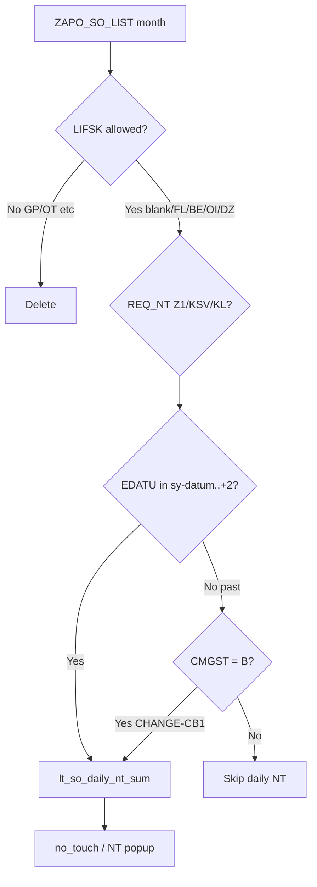

# ZGATPDB — Credit-block past VDATU order missing from NT popup (0 vs expected)

**System:** DEVSCMAD1 (`ZAPO_GATP_ALLOCATION_F005` — live source reviewed 20/07/2026)  
**Program:** `ZAPO_GATP_ALLOCATION_REPORT` / **T-code:** `ZGATPDB`  
**Param:** `NT_MT_NEW` / `REPORT_NEW`  
**Tables:** `ZAPO_SO_LIST`  
**Popup:** gATP Manual & NO Touch Report — **NT (Plant)**  
**Version:** 1.0 — 20/07/2026  

---

## 1. Symptom

| Item | Value |
|------|--------|
| Sales order (screenshot) | **`0300059795`** |
| Material / Plant / GC | `B120MA` / `3605` / `5000000617` |
| Credit block | **`CMGST = 'B'`** |
| Delivery block | **`LIFSK = blank`** (no other block) |
| Requested delivery date | **`EDATU / VDATU = 06.07.2026`** (past / “in the back”) |
| Order quantity (`WMENG`) | **1,500.000** (`BMENG = 0`) |
| `REQ_NT` | **`Z1`** |
| Availability check / report run | **Today** (e.g. 20.07.2026) |
| **Expected** NT (Plant) | Order qty visible (example **1,500**; selection total may be higher, e.g. **15,500**) |
| **Actual** NT (Plant) popup | **0** (all cells zero) |

**Business rule**

> Open NT order with **credit block only** (`CMGST = 'B'`) and **no delivery block** (`LIFSK` blank), even if **Requested Delivery Date is in the past**, must appear in the **NT Report** when ATP / `ZGATPDB` is executed **today**.

---

## 2. AD1 data confirmation

```text
VBELN  = 0300059795
MATNR  = B120MA
WERKS  = 3605
GCCODE = 5000000617
EDATU  = 20260706          ← past vs run date
WMENG  = 1500
BMENG  = 0
LIFSK  = space
CMGST  = B
REQ_NT = Z1
DELIND / ABGRU = space
```

Order is open and eligible. It is **not** filtered out by `LIFSK` / `VKORG` DELETE on `lt_so_all`.

---

## 3. Root cause (AD1 live code)

### 3.1 Popup / grid NT uses forward EDATU window only

**`get_data` CHANGE C** builds `lt_so_daily_nt_sum` (~839):

```abap
lv_so_nt_edatu_high = sy-datum + 2.

IF lw_so_all-edatu >= sy-datum
AND lw_so_all-edatu <= lv_so_nt_edatu_high
AND ( req_nt = 'Z1' OR 'KSV' OR 'KL' ).
  " daily_nt = BMENG or WMENG
  COLLECT INTO lt_so_daily_nt_sum.
ENDIF.
```

| Order EDATU | Window today (e.g. 20–22 Jul) | In `lt_so_daily_nt_sum`? |
|-------------|-------------------------------|---------------------------|
| **06.07.2026** | `sy-datum .. +2` | **No** ✗ |

**CHANGE F** then sets:

```abap
<fs_output>-no_touch = ls_so_daily_nt_sum-daily_nt - lv_saved_nt.
" else CLEAR no_touch
```

→ Grid **`no_touch = 0`** for this CVC.

### 3.2 New-param popup NT = grid `no_touch` only

**`get_gatprep_data`** (~7219):

```abap
*--- NT: New param — grid no_touch (netted); Old = grid + SO additive
IF lv_new_gatp_param = abap_false.
  gw_ntch_* = gw_ntch_* + gw_apo_so_nt_*.
ENDIF.
```

Under **new param**, popup NT does **not** add `get_zapo_so_list` totals.  
It only shows selected-row **`no_touch`** → **0**.

Even if SO list were used, popup mode also filters:

```abap
so_date-low  = sy-datum.
so_date-high = sy-datum + 2.   " get_zapo_so_list ~3734
AND edatu IN so_date.          " excludes 06.07.2026
```

### 3.3 Credit-block logic adds to `inc_ord_quan` only — not NT

**CHANGE C** (~864) fills `lt_cb_ord` for `CMGST = 'B'` (full month from `lt_so_all`, **no EDATU forward filter**).

**CHANGE F** (~2634):

```abap
*--- Add credit block orders to PAG AEMENGE (BR5)
<fs_output>-inc_ord_quan = <fs_output>-inc_ord_quan + lw_cb_qty.
```

| Bucket | Credit-block past EDATU? |
|--------|---------------------------|
| `inc_ord_quan` (incoming / cap) | Yes (via `lt_cb_ord`) |
| `no_touch` / NT popup | **No** ✗ |

So CB is treated as **incoming top-up**, but **never as NT quantity** once `EDATU` has slipped into the past.

---

## 4. Why this matches the screenshot

```text
SO 0300059795: CMGST=B, LIFSK=blank, EDATU=06.07, WMENG=1500, REQ_NT=Z1
        │
        ├─ lt_so_all (month)     → kept (LIFSK blank allowed)
        ├─ lt_cb_ord             → 1500 added to inc_ord_quan only
        ├─ lt_so_daily_nt_sum    → skipped (EDATU < sy-datum)
        ├─ no_touch              → 0
        └─ NT popup (new param)  → 0
```

Dashboard row exists (`B120MA` / `3605`) but quantities show **0.000**; NT popup all **0**.

---

## 5. Required behaviour

```text
Open NT demand today =

  (A) Forward-window SO NT
      EDATU BETWEEN sy-datum AND sy-datum+2
      REQ_NT IN (Z1, KSV, KL)

  UNION

  (B) Credit-block open NT with past (or today) EDATU
      CMGST = 'B'
      LIFSK IN (space, FL, BE, OI, DZ)   " already kept in lt_so_all
      ABGRU = space, DELIND = space
      REQ_NT IN (Z1, KSV, KL)
      EDATU < sy-datum                  " "VDATU in the back"
      EDATU >= month_start              " already limited by lt_so_all SELECT
```

Quantity: `BMENG` if `> 0`, else `WMENG` (same as existing daily NT / popup WMENG fallback).

**Do not** require `EDATU >= sy-datum` for branch (B).

---

## 6. Code corrections (`ZAPO_GATP_ALLOCATION_F005`)

### 6.1 CHANGE-CB1 — Include past-EDATU credit-block lines in `lt_so_daily_nt_sum`

**Location:** `get_data` CHANGE C loop (~839), **after** the existing forward-window block (or merge into one IF).

**Replace / extend:**

```abap
*--- (A) Forward window — existing
IF lw_so_all-edatu >= sy-datum
AND lw_so_all-edatu <= lv_so_nt_edatu_high
AND ( lw_so_all-req_nt = 'Z1'
   OR lw_so_all-req_nt = 'KSV'
   OR lw_so_all-req_nt = 'KL' ).
  " ... existing COLLECT ls_so_daily_nt_sum ...
ENDIF.

*--- (B) CHANGE-CB1: Credit block + no DLV block + past EDATU → still NT today
IF lw_so_all-cmgst = 'B'
AND lw_so_all-abgru = space
AND lw_so_all-edatu < sy-datum
AND ( lw_so_all-req_nt = 'Z1'
   OR lw_so_all-req_nt = 'KSV'
   OR lw_so_all-req_nt = 'KL' ).
  CLEAR ls_so_daily_nt_sum.
  ls_so_daily_nt_sum-gccode = lw_so_all-gccode.
  ls_so_daily_nt_sum-matnr  = lw_so_all-matnr.
  ls_so_daily_nt_sum-werks  = lw_so_all-werks.
  ls_so_daily_nt_sum-vtweg  = lw_so_all-vtweg.
  READ TABLE gt_matclass INTO gw_matclass
    WITH KEY zgrade = lw_so_all-matnr BINARY SEARCH.
  IF sy-subrc = 0.
    ls_so_daily_nt_sum-spart = gw_matclass-zpdi.
  ELSE.
    ls_so_daily_nt_sum-spart = lw_so_all-spart.
  ENDIF.
  IF lw_so_all-bmeng > 0.
    ls_so_daily_nt_sum-daily_nt = lw_so_all-bmeng.
  ELSE.
    ls_so_daily_nt_sum-daily_nt = lw_so_all-wmeng.
  ENDIF.
  COLLECT ls_so_daily_nt_sum INTO lt_so_daily_nt_sum.
ENDIF.
```

**Notes**

- `LIFSK` already restricted on `lt_so_all` (blank / FL / BE / OI / DZ kept).  
- `GP` / `OT` / other blocks remain excluded by that DELETE.  
- Same COLLECT key as forward window → one CVC total for CHANGE F / popup.

**Effect for `0300059795`:** `daily_nt` includes **1500** → `no_touch = 1500` (minus prior backup if any) → NT popup shows **1500**.

---

### 6.2 CHANGE-CB2 — Align popup SO select for past CB (safety / old-param parity)

**Location:** `get_zapo_so_list` when `iv_popup_mode = abap_true` (~3734).

**Option A (minimal, preferred with CHANGE-CB1):**  
No change required for **new param** (popup NT uses grid `no_touch`).

**Option B (if old param still adds SO NT, or dual-path needed):**  
After main SELECT for `sy-datum..+2`, append credit-block past lines:

```abap
*--- Popup: also fetch open CB with past EDATU (month start .. sy-datum-1)
DATA: lv_mstart TYPE datum.
CONCATENATE sy-datum+0(6) '01' INTO lv_mstart.

SELECT ... FROM zapo_so_list
  APPENDING TABLE lt_so_list_pop
  WHERE spart  IN lt_spart_r
    AND matnr  IN so_mat
    AND werks  IN so_loc
    AND delind = space
    AND abgru  = space
    AND cmgst  = 'B'
    AND ( lifsk = space OR lifsk = 'FL' OR lifsk = 'BE'
       OR lifsk = 'OI' OR lifsk = 'DZ' )
    AND edatu  BETWEEN lv_mstart AND sy-datum - 1
    AND ( req_nt = 'Z1' OR req_nt = 'KSV' OR req_nt = 'KL' ).
```

Then keep existing WMENG→BMENG fallback when `BMENG = 0`.

---

### 6.3 CHANGE-CB3 — Avoid double-count with `lt_cb_ord` on `inc_ord_quan` (clarify only)

`lt_cb_ord` → `inc_ord_quan` remains for **incoming / cap (BR5)**.  
`lt_so_daily_nt_sum` → `no_touch` is the **NT report** path.

Do **not** set `no_touch = inc_ord_quan - manual_touch` for this fix.  
Keep paths separate so MT from `ZAPO_ADB_ADJ` stays intact.

Optional guard: if a past CB line is already fully backed up as `NO_TOUCH` yesterday, existing `lv_saved_nt` / `lt_prime_yday_nt` netting still applies.

---

### 6.4 Do **not** widen all NT to full month

Widening **all** `REQ_NT` to month start would bring back MTD popup inflation (see `ZGATPDB_Popup_NT_MTD_1605_Daily_Code_Correction.md`).

Only **credit-block + past EDATU + allowed LIFSK** should bypass the forward window.

---

## 7. Flow after fix



---

## 8. Test plan

| # | Scenario | Expected NT (Plant) |
|---|----------|---------------------|
| T1 | `0300059795` — CB, LIFSK blank, EDATU 06.07, WMENG 1500; run today | **≥ 1500** for PP / PMR (not 0) |
| T2 | Same CVC, select ALV row `B120MA`/`3605` → popup | NT shows order qty |
| T3 | Order with `LIFSK = 'GP'` or `'OT'` + CMGST=B | **Still excluded** |
| T4 | Normal NT order EDATU = today / +1 / +2, CMGST ≠ B | Unchanged (forward window) |
| T5 | Past EDATU, CMGST blank (not credit block) | **Not** forced into NT by CHANGE-CB1 |
| T6 | Past CB already backed up yesterday as NO_TOUCH | Net to 0 if `lv_saved_nt` covers it |
| T7 | UA released same day (`ZAPO_ADB_ADJ`) | MT from adj; NT not inflated by MT |

**Verification SQL (AD1):**

```sql
SELECT vbeln, matnr, werks, edatu, wmeng, bmeng, lifsk, cmgst, req_nt
  FROM zapo_so_list
 WHERE vbeln = '0300059795';

-- Open CB + blank LIFSK + past EDATU this month (eligible after CHANGE-CB1)
SELECT vbeln, edatu, wmeng, lifsk, cmgst, req_nt
  FROM zapo_so_list
 WHERE matnr  = 'B120MA'
   AND werks  = '3605'
   AND gccode = '5000000617'
   AND cmgst  = 'B'
   AND lifsk  = ' '
   AND delind = ' '
   AND abgru  = ' '
   AND edatu  < sy-datum
   AND edatu  >= '20260701'
   AND req_nt IN ('Z1','KSV','KL');
```

---

## 9. Transport checklist

| # | Object | Change |
|---|--------|--------|
| 1 | `ZAPO_GATP_ALLOCATION_F005` | §6.1 CHANGE-CB1 — past CB into `lt_so_daily_nt_sum` |
| 2 | Same (optional) | §6.2 CHANGE-CB2 — popup SO append for old-param / safety |
| 3 | Test | T1–T5 with `0300059795` / `B120MA` / `3605` |

---

## 10. Related MDs

| MD | Topic |
|----|-------|
| `MT_NT_Credit_Block_Code_Change_v1.md` | CB into `inc_ord_quan` / PAG zero AEMENGE |
| `ZGATPDB_Future_EDATU_Backup_Popup_Net_NT_Code_Correction.md` | Future EDATU backup netting |
| `ZGATPDB_Popup_NT_MTD_1605_Daily_Code_Correction.md` | Do not use full-month EDATU for all NT |

**This MD:** Past **VDATU** + **CMGST=B** + **LIFSK blank** must still feed **NT popup** on today’s ATP run.

---

## 11. Summary

| Question | Answer |
|----------|--------|
| Why NT = **0**? | Daily / popup NT only accepts `EDATU` in **`sy-datum..+2`** |
| Why is SO still “valid”? | `CMGST=B`, `LIFSK` blank, open — kept in `lt_so_all` / `lt_cb_ord` |
| Where does CB go today? | **`inc_ord_quan` only** — not **`no_touch`** |
| Primary fix | CHANGE-CB1: collect past-EDATU CB into **`lt_so_daily_nt_sum`** |
| Example order impact | **`0300059795` → 1,500 MT** appears in NT (Plant) |

---

*End of document*
