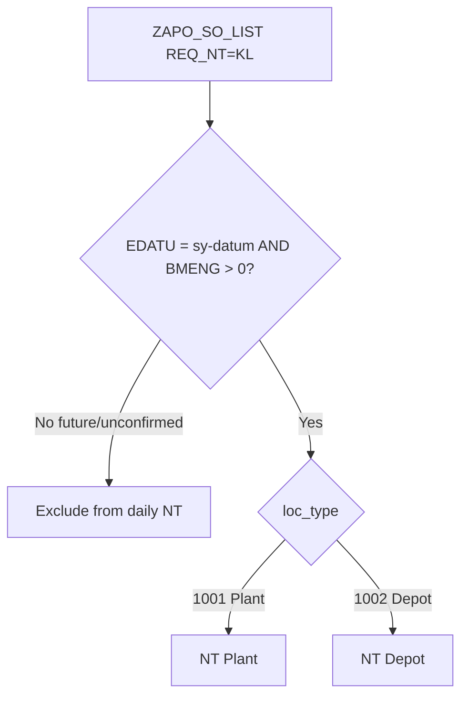

# ZGATPDB — Depot + Plant: Stock strategy (`REQ_NT='KL'`) future RDD only on RDD day

**System:** DEVSCMAD1 (`ZAPO_GATP_ALLOCATION_F005` — last verified live source; AD1 MCP unavailable at write time)  
**Program:** `ZAPO_GATP_ALLOCATION_REPORT` / **T-code:** `ZGATPDB`  
**Param:** `NT_MT_NEW` (Plant derivation) + Old-style paths for Depot  
**Scope:** **`REQ_NT = 'KL'` only** — Plant **`1001` and Depot `1002`**  
**Do not change:** Z1/KSV windows, UA/ADB MT, credit-block, Plant-only new-param gate for non-KL  
**Version:** 1.0 — 03/08/2026  

---

## 1. Observation

| Item | Detail |
|------|--------|
| Location | **Depot `1002`** |
| Order type | Stock strategy **`REQ_NT = 'KL'`** |
| RDD | **Future** `VDATU` / `EDATU` |
| Symptom | Quantity appears in **NT** (dashboard / MT–NT popup) **today** |
| Expected | **Not today** — only on that **specific RDD day** (`EDATU = sy-datum`) |
| Scope of rule | **Plant and Depot** (stock strategy only) |

---

## 2. Why this happens even if “Depot = Old” and “KL future fixed”

Two separate designs interact:

| Design | Intent | Gap for Depot KL |
|--------|--------|------------------|
| **New param Plant-only** (`ZGATPDB_NewParam_PlantOnly_1001_…`) | CHANGE F new MT/NT/CB only for `1001` | Depot skips new `lt_so_daily_nt_sum` — **OK for CB/UA** |
| **KL RDD-day fix** (`ZGATPDB_StockStrategy_KL_RDD_Day_Only_…`) | KL daily NT only if `EDATU = sy-datum` | If applied only in **CHANGE C `lt_so_daily_nt_sum`**, it mainly protects **Plant new-param grid**. **Depot does not use that path.** |

### 2.1 Depot NT still comes from SO list (Old-style / popup path)

Under new param, Plant grid NT uses `lt_so_daily_nt_sum`.  
**Depot** stays on **legacy / SO popup** paths. KL for Depot is still selected with:

**`get_zapo_so_list`** (~3734–3739, ~4079–4120):

```abap
*--- Popup date window (new param)
so_date-low  = sy-datum.
so_date-high = sy-datum + 2.     " includes FUTURE EDATU

" ... SELECT ZAPO_SO_LIST ... edatu IN so_date

LOOP AT lt_apo_so_list_nt ...
  IF loc_type = '1002'.
    gw_apo_so_nt_*_depot = gw_apo_so_nt_*_depot + bmeng.  " ← future KL added
  ENDIF.
ENDLOOP.
```

**`merge_kl_so_cvc_to_output`** popup (~3501–3506):

```abap
lrw_date-low  = sy-datum.
lrw_date-high = sy-datum + 2.   " KL SELECT — future RDD included
AND req_nt = 'KL'.
```

So:

```text
Depot future KL  →  get_zapo_so_list / merge_kl (sy-datum..+2)
                 →  gw_apo_so_nt_*_depot / KL driver qty
                 →  NT Depot (or additive / mail / any consumer of these totals)
```

Plant-only CHANGE F **does not block** this SO path.  
KL RDD fix on **daily_nt only** **does not block** Depot.

### 2.2 Old param behaviour for KL

Old popup SO path often kept **`REQ_NT = 'KL'`** and used a date range. With new-param popup SELECT forced to **`sy-datum..+2`**, Depot KL inherits the **forward window** — same bug Plant had before the RDD-day split.

---

## 3. Required rule (unchanged intent — both locations)

```text
IF REQ_NT = 'KL':
  Daily NT (Plant or Depot):
    BMENG > 0 AND EDATU = sy-datum     " specific RDD day only

  MTD:
    BMENG > 0 AND EDATU BETWEEN month_start AND sy-datum

IF REQ_NT = 'Z1' OR 'KSV':
  Keep existing logic (Plant new-param / Depot old) — no change
```

| Location | Future KL confirmed today | On RDD day |
|----------|---------------------------|------------|
| Plant `1001` | Hide | Show |
| Depot `1002` | Hide | Show |

---

## 4. Code corrections — KL only, Plant + Depot

### 4.1 CHANGE-KL-D1 — `get_zapo_so_list`: filter future KL before plant/depot sum

**Location:** Immediately before `LOOP AT lt_apo_so_list_nt` (~4078), after NT table is filled.

```abap
*--- Stock strategy KL: Plant + Depot — only RDD = today (confirmed)
LOOP AT lt_apo_so_list_nt ASSIGNING FIELD-SYMBOL(<nt_line>).
  IF <nt_line>-req_nt = 'KL'.
    IF <nt_line>-edatu <> sy-datum OR <nt_line>-bmeng <= 0.
      DELETE lt_apo_so_list_nt.
      CONTINUE.
    ENDIF.
  ENDIF.
ENDLOOP.
```

This single filter covers:

- `loc_type = '1001'` → `gw_apo_so_nt_*_plant`
- `loc_type = '1002'` → `gw_apo_so_nt_*_depot`

**Do not** change `so_date` for the whole SELECT (Z1/KSV may still need `sy-datum..+2` under new param).

Also apply the same filter if an older branch uses `gt_apo_so_list` with `DELETE … WHERE req_nt NE 'KL'` only (~3992).

---

### 4.2 CHANGE-KL-D2 — `merge_kl_so_cvc_to_output`: popup = today only

**Location:** ~3501 (popup branch). Applies to **all** KL werks (plant and depot).

```abap
ELSEIF lv_new_param = abap_true AND iv_popup_mode = abap_true.
*--- KL popup: RDD day only (Plant + Depot) — was sy-datum..+2
  lrw_date-sign   = 'I'.
  lrw_date-option = 'EQ'.
  lrw_date-low    = sy-datum.
  APPEND lrw_date TO lrt_date.
```

**MTD / non-popup** (`iv_popup_mode = abap_false`):

```abap
lrw_date-low  = lv_month_start.   " 1st of month
lrw_date-high = sy-datum.         " till today — no future
```

After SELECT:

```abap
DELETE lt_fetch_kl  WHERE bmeng <= 0.
DELETE lt_fetch_all WHERE bmeng <= 0.
```

---

### 4.3 CHANGE-KL-D3 — `get_data` CHANGE C: keep KL out of `+2` daily NT (Plant path)

Still required for Plant new-param grid (and any path that still reads `lt_so_daily_nt_sum` for a depot row):

```abap
*--- Z1/KSV unchanged: sy-datum..+2
IF edatu IN [sy-datum .. sy-datum+2]
AND ( req_nt = 'Z1' OR req_nt = 'KSV' ).
  COLLECT lt_so_daily_nt_sum.
ENDIF.

*--- KL Plant + Depot: confirmed + EDATU = today only
IF req_nt = 'KL'
AND bmeng > 0
AND edatu = sy-datum.
  COLLECT lt_so_daily_nt_sum.
ENDIF.
```

No `loctype` check needed here — same calendar rule for every werks.

---

### 4.4 Do **not** weaken Plant-only new-param gate

| Topic | Action |
|-------|--------|
| Credit block / ADB MT / Incoming−MT new formula | Remain **`1001` only** (separate MD) |
| Depot legacy ELSE | Unchanged |
| This MD | Only **KL + EDATU** filters in SO/merge/daily_nt |

KL RDD filtering in `get_zapo_so_list` / `merge_kl` is **location-agnostic** and does **not** re-enable new-param CB/UA for Depot.

---

## 5. Flow after fix



---

## 6. Test plan

| # | Scenario | Expected |
|---|----------|----------|
| T1 | Depot KL, `EDATU = sy-datum + 1`, confirmed | **Not** in today’s NT Depot |
| T2 | Same order on RDD day | **In** NT Depot that day |
| T3 | Plant KL, future EDATU, confirmed | **Not** in today’s NT Plant |
| T4 | Plant KL, `EDATU = today` | In NT Plant |
| T5 | Depot Z1/KSV, `EDATU = sy-datum + 1` | Unchanged (Old / existing window) |
| T6 | Depot credit block | Still Old behaviour (Plant-only MD) — unaffected |
| T7 | Popup PMR Depot NT | No future KL |

**SQL**

```sql
SELECT vbeln, matnr, werks, edatu, bmeng, req_nt
  FROM zapo_so_list
 WHERE req_nt = 'KL'
   AND bmeng  > 0
   AND edatu  > sy-datum
   AND delind = ' '
   AND abgru  = ' ';
-- These werks with loc_type 1002 must not contribute to today's NT Depot
```

---

## 7. Transport checklist

| # | Object | Change |
|---|--------|--------|
| 1 | `ZAPO_GATP_ALLOCATION_F005` | §4.1 — `get_zapo_so_list` drop future KL (plant+depot sums) |
| 2 | Same | §4.2 — `merge_kl` popup `EDATU = today`; MTD month→today |
| 3 | Same | §4.3 — CHANGE C KL daily NT `EDATU = today` only |
| 4 | Test | T1–T3 mandatory |

---

## 8. Related MDs

| MD | Relationship |
|----|----------------|
| `ZGATPDB_StockStrategy_KL_RDD_Day_Only_Code_Correction.md` | Original KL RDD rule — extend explicitly to Depot SO path |
| `ZGATPDB_NewParam_PlantOnly_1001_Depot_OldLogic_Code_Correction.md` | Depot stays Old for CB/UA — **do not** use to skip KL RDD filter in SO list |
| `ZGATPDB_Future_EDATU_NextDay_NT_Reappear_After_Backup_Code_Correction.md` | Non-KL backup netting — separate |

---

## 9. Summary

| Question | Answer |
|----------|--------|
| Why Depot future KL still shows? | Depot NT uses **`get_zapo_so_list` / `merge_kl`** with **`sy-datum..+2`**, not Plant `lt_so_daily_nt_sum` |
| Why Plant-only doesn’t stop it? | Plant-only gates **CHANGE F**, not KL SO date window |
| Fix | Filter **`REQ_NT='KL'`** to **`EDATU = sy-datum`** (+ confirmed) in SO/merge/daily_nt for **1001 and 1002** |
| Other logic | Untouched |

---

*End of document*
