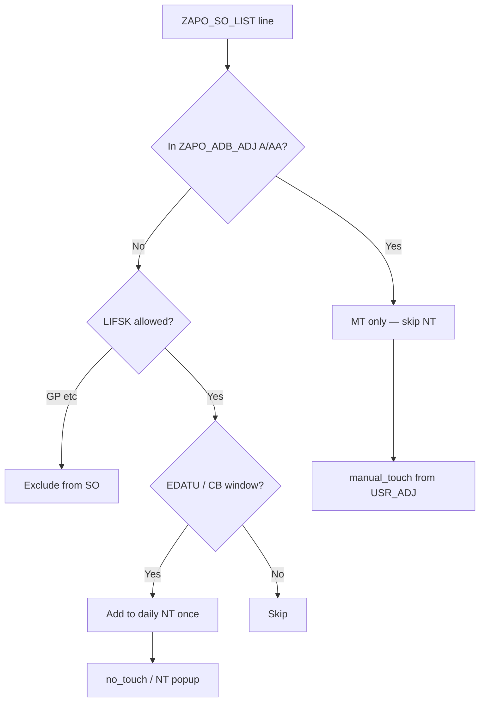

# ZGATPDB — GP/UA order double-counted in NT (30 instead of 15); same for Credit Block release

**System:** DEVSCMAD1 (`ZAPO_GATP_ALLOCATION_F005` — last verified live source; AD1 MCP offline at analysis time)  
**Program:** `ZAPO_GATP_ALLOCATION_REPORT` / **T-code:** `ZGATPDB`  
**Param:** `NT_MT_NEW` / `REPORT_NEW`  
**Popup:** gATP Manual & NO Touch Report  
**Tables:** `ZAPO_SO_LIST`, `ZAPO_ADB_ADJ`, `ZAPO_PRIME_BCKU`  
**Version:** 1.0 — 24/07/2026  

---

## 1. Symptom (screenshot 24.07.2026)

| Bucket | Shown | Expected |
|--------|-------|----------|
| **MT (Plant)** PMR / PP | **15** | **15** ✓ |
| **NT (Plant)** PMR / PP | **30** | **15** ✗ |

**Grid (same run):** Manual Tch = **15**, No Tch = **15** on one row — popup NT still **30** (or grid/popup both inflated depending on selection).

### Business scenario A — GP block + UA (matches screenshot)

| Step | State | Expected popup | Actual |
|------|--------|----------------|--------|
| 1 | Order in **`LIFSK = 'GP'`**; UA done on ADB Dashboard | **MT = 15**, **NT = 15** (other open NT) | MT=15, NT=15 ✓ |
| 2 | **GP removed**; order confirmed / cleared | **MT = 15**, **NT = 15** (no second count) | **MT = 15**, **NT = 30** ✗ |

**Rule:** Quantity already counted once as **MT** (via `ZAPO_ADB_ADJ`) must **not** enter **NT** again after GP is cleared.

```text
30 = 15 (original open NT) + 15 (same order after GP cleared, now in SO NT)
```

### Business scenario B — Credit block release (same principle)

| Step | State | Expected |
|------|--------|----------|
| 1 | Order **`CMGST = 'B'`**, counted in **NT** once | NT includes qty once |
| 2 | Credit block **cleared / released** | Same qty stays **once** in NT — **not** added again |

---

## 2. Root cause (AD1 code)

### 2.1 While `LIFSK = 'GP'` — order is **out** of SO NT, **in** MT via UA

**CHANGE C** deletes non-allowed delivery blocks from `lt_so_all` (~550):

```abap
DELETE lt_so_all
  WHERE ( lifsk NE 'FL' AND lifsk NE 'BE' AND lifsk NE 'OI'
      AND lifsk NE space AND lifsk NE 'DZ' )
     OR ( vkorg NE '1010' AND vkorg NE '1020' ).
```

→ **`LIFSK = 'GP'`** is removed from cap / daily NT / CB aggregates.

**CHANGE B** still loads today’s UA (~473):

```abap
SELECT ... sales_order posnr ... usr_adj
  FROM zapo_adb_adj
 WHERE ua_approv_status IN ('A','AA')
   AND approved_date = sy-datum.
```

**CHANGE F:** `manual_touch = usr_adj` → **MT = 15**.  
Other open NT lines → **NT = 15**. Popup: **MT=15, NT=15**. Correct.

### 2.2 After GP cleared — same order enters daily NT **without** excluding UA

Forward-window NT (~839) has **no** check against `ZAPO_ADB_ADJ`:

```abap
IF lw_so_all-edatu >= sy-datum
AND lw_so_all-edatu <= lv_so_nt_edatu_high
AND ( req_nt = 'Z1' OR 'KSV' OR 'KL' ).
  " daily_nt = BMENG / WMENG
  COLLECT INTO lt_so_daily_nt_sum.   " ← includes ex-GP order
ENDIF.
```

| Source | After GP clear |
|--------|----------------|
| `ZAPO_ADB_ADJ` UA (today) | Still **15** → **MT = 15** |
| `lt_so_daily_nt_sum` | Original **15** + cleared-GP **15** → **30** |
| `no_touch` / NT popup | **30** ✗ |

**Gap:** No link between **sales order already released via UA (MT)** and **SO daily NT**.

### 2.3 Credit-block analogue

- While **`CMGST = 'B'`**, order can enter NT (forward window and/or past-EDATU CB logic).
- After credit is cleared, the **same `VBELN`/`POSNR`** still matches the NT SELECT if `EDATU` / `REQ_NT` qualify.
- A second execution (or CB path + normal path without VBELN guard) can **add the same qty again**, especially if prior NT was already backed up / shown and not netted at **order** level.

**Same rule:** Count each sales-order item **once** across MT and NT.

---

## 3. Required behaviour

```text
MT  = SUM( ZAPO_ADB_ADJ.USR_ADJ )   today, status A/AA     (unchanged BR1)

NT  = SUM( ZAPO_SO_LIST qty for REQ_NT )
        WHERE EDATU in daily / CB-eligible window
          AND LIFSK allowed
          AND VBELN+POSNR NOT already in ZAPO_ADB_ADJ (A/AA)
          AND (for CB release) not double-collected vs prior NT for same VBELN+POSNR
```

| Step | MT | NT |
|------|----|----|
| GP + UA | 15 | 15 (other SO only) |
| GP cleared, UA still approved | **15** | **15** (ex-GP SO excluded because in ADB_ADJ) |
| CB in NT, then CB cleared | — | Same qty **once** |

---

## 4. Code corrections (`ZAPO_GATP_ALLOCATION_F005`)

### 4.1 CHANGE-X1 — Build hash of UA sales orders (exclude from NT)

**Location:** `get_data`, immediately after CHANGE B fills `lt_mt_adj` (~489).

```abap
TYPES: BEGIN OF lty_ua_so_key,
         sales_order TYPE vbeln_va,
         posnr       TYPE posnr,
       END OF lty_ua_so_key.

DATA: lt_ua_so_excl TYPE HASHED TABLE OF lty_ua_so_key
                      WITH UNIQUE KEY sales_order posnr,
      ls_ua_so_excl TYPE lty_ua_so_key.

*--- Prefer month-to-date UA so prior-day ADB MT still blocks NT after GP clear
DATA: lv_ua_mstart TYPE datum.
CONCATENATE sy-datum+0(6) '01' INTO lv_ua_mstart.

SELECT sales_order posnr
  FROM zapo_adb_adj
  INTO TABLE lt_ua_so_excl
  WHERE division IN so_divi
    AND ua_approv_status IN ('A', 'AA')
    AND approved_date BETWEEN lv_ua_mstart AND sy-datum.
* If only "today" UA must exclude NT, keep approved_date = sy-datum
* (screenshot case is same-day — both work).
```

> **Recommendation:** Use **month-to-date** `APPROVED_DATE` so a GP order UAed yesterday and cleared today does not reappear as NT while MT already hit backup / prior day.

Keep existing CHANGE B SELECT for **today-only** `lt_mt_adj` / `manual_touch` (daily MT unchanged).

---

### 4.2 CHANGE-X2 — Skip UA orders when filling `lt_so_daily_nt_sum`

**Location:** CHANGE C daily NT block (~839) and any past-EDATU CB→NT block (CHANGE-CB1 if deployed).

```abap
IF lw_so_all-edatu >= sy-datum
AND lw_so_all-edatu <= lv_so_nt_edatu_high
AND ( lw_so_all-req_nt = 'Z1'
   OR lw_so_all-req_nt = 'KSV'
   OR lw_so_all-req_nt = 'KL' ).

*--- CHANGE-X2: already counted as MT via ADB UA — do not add to NT
  READ TABLE lt_ua_so_excl TRANSPORTING NO FIELDS
    WITH TABLE KEY sales_order = lw_so_all-vbeln
                   posnr       = lw_so_all-posnr.
  IF sy-subrc = 0.
    CONTINUE.   " or skip only this IF body
  ENDIF.

  " ... existing COLLECT ls_so_daily_nt_sum ...
ENDIF.
```

Apply the **same `READ TABLE lt_ua_so_excl`** guard on any **credit-block → daily NT** branch so a CB order that was UAed is not also NT.

---

### 4.3 CHANGE-X3 — Credit block: count each `VBELN`+`POSNR` only once in NT

**Location:** Same CHANGE C loop.

1. **Do not** COLLECT the same line twice if both forward-window and CB-past branches exist (use mutually exclusive `EDATU` tests — already true if CB branch is `EDATU < sy-datum` only).

2. After credit clearance, rely on a **single** SO path (forward / open). No second add from `lt_cb_ord` into `no_touch` (`lt_cb_ord` stays on **`inc_ord_quan` only**).

3. Keep / strengthen **prior NT netting** (already in CHANGE F):

```abap
lv_net_nt = ls_so_daily_nt_sum-daily_nt - lv_saved_nt.
```

So if CB qty was already saved to `ZAPO_PRIME_BCKU-NO_TOUCH` yesterday, today’s run does not show it again as fresh NT.

4. Optional hardening — hashed collected keys:

```abap
TYPES: BEGIN OF lty_nt_so_done,
         vbeln TYPE vbeln_va,
         posnr TYPE posnr,
       END OF lty_nt_so_done.
DATA: lt_nt_so_done TYPE HASHED TABLE OF lty_nt_so_done
                      WITH UNIQUE KEY vbeln posnr.

" Before COLLECT into lt_so_daily_nt_sum:
READ TABLE lt_nt_so_done TRANSPORTING NO FIELDS
  WITH TABLE KEY vbeln = lw_so_all-vbeln posnr = lw_so_all-posnr.
IF sy-subrc = 0.
  " already collected this item into daily NT — skip
ELSE.
  INSERT VALUE #( vbeln = lw_so_all-vbeln posnr = lw_so_all-posnr )
    INTO TABLE lt_nt_so_done.
  COLLECT ls_so_daily_nt_sum INTO lt_so_daily_nt_sum.
ENDIF.
```

---

### 4.4 CHANGE-X4 — `get_zapo_so_list` popup path (safety)

**Location:** After SELECT into `lt_so_list_pop` / before NT sum (~3828 / ~4078).

```abap
LOOP AT lt_apo_so_list_nt ASSIGNING <lfs_apo_so_list>.
  READ TABLE lt_ua_so_excl TRANSPORTING NO FIELDS
    WITH TABLE KEY sales_order = <lfs_apo_so_list>-vbeln
                   posnr       = <lfs_apo_so_list>-posnr.
  IF sy-subrc = 0.
    DELETE lt_apo_so_list_nt.  " or CLEAR bmeng / CONTINUE
    CONTINUE.
  ENDIF.
ENDLOOP.
```

Requires `lt_ua_so_excl` as class attribute filled in `get_data`, **or** a local re-SELECT of ADB keys inside `get_zapo_so_list`.

New param popup mainly uses grid `no_touch` (CHANGE-X2 is enough for the screenshot). X4 protects old-param / additive SO paths.

---

### 4.5 Do **not** use CVC-level `no_touch = daily_nt − manual_touch`

| State | daily_nt | MT | daily_nt − MT | Needed |
|-------|----------|----|---------------|--------|
| GP + UA | 15 | 15 | **0** ✗ | NT **15** |
| GP cleared | 30 | 15 | 15 ✓ | NT **15** |

CVC subtract breaks step 1. **Order-level ADB exclusion (X1/X2)** is required.

---

## 5. Flow after fix



---

## 6. Test plan

| # | Scenario | MT | NT |
|---|----------|----|----|
| T1 | Order GP + UA 15; other open NT 15 | **15** | **15** |
| T2 | Clear GP on UA order; re-run same day | **15** | **15** (not 30) |
| T3 | UA order only (no other NT); clear GP | **15** | **0** |
| T4 | Normal NT 15, no UA | **0** | **15** |
| T5 | CB order in NT 15; clear CMGST; same EDATU window | — | **15** once (not 30) |
| T6 | CB NT backed up yesterday; clear CB today | — | **0** or net of new only |
| T7 | `LIFSK=GP` without UA | **0** | unchanged (GP still excluded from SO) |

**Verification SQL:**

```sql
-- UA orders that must be excluded from NT
SELECT sales_order, posnr, usr_adj, approved_date, ua_approv_status
  FROM zapo_adb_adj
 WHERE approved_date BETWEEN '20260701' AND sy-datum
   AND ua_approv_status IN ('A','AA');

-- After GP clear: SO line now eligible for NT SELECT but must be skipped
SELECT vbeln, posnr, lifsk, cmgst, edatu, wmeng, bmeng, req_nt
  FROM zapo_so_list
 WHERE lifsk = ' '
   AND req_nt IN ('Z1','KSV','KL')
   AND edatu BETWEEN sy-datum AND sy-datum + 2;
```

---

## 7. Transport checklist

| # | Object | Change |
|---|--------|--------|
| 1 | `ZAPO_GATP_ALLOCATION_F005` | §4.1 `lt_ua_so_excl` from `ZAPO_ADB_ADJ` |
| 2 | Same | §4.2 Skip UA keys in `lt_so_daily_nt_sum` |
| 3 | Same | §4.3 CB once-only + keep NT backup netting |
| 4 | Same (optional) | §4.4 `get_zapo_so_list` exclude UA keys |
| 5 | Test | T1–T2 (GP) and T5 (CB) |

---

## 8. Related MDs

| MD | Topic |
|----|-------|
| `ZGATPDB_NT_Plant_GP_Block_CodeChange.md` | Exclude GP from popup while blocked |
| `ZGATPDB_Popup_NT_Reduced_UA_Order_Code_Correction.md` | Do not shrink independent NT when UA adds MT |
| `ZGATPDB_CreditBlock_Past_VDATU_NT_Missing_Code_Correction.md` | Past VDATU CB must appear in NT |
| `ZGATPDB_Future_EDATU_Backup_Popup_Net_NT_Code_Correction.md` | Net NT vs prior backup |

**This MD:** After **GP clear** (or **CB release**), qty already counted as **MT (UA)** or already counted once as **NT** must not inflate NT to **30**.

---

## 9. Summary

| Question | Answer |
|----------|--------|
| Why NT = **30**? | Original NT **15** + ex-GP order **15** now in `lt_so_daily_nt_sum` |
| Why MT still **15**? | `ZAPO_ADB_ADJ` UA for today still valid |
| Why wasn’t it double before? | `LIFSK=GP` deleted from `lt_so_all` — not in SO NT |
| Primary fix | Exclude `VBELN`/`POSNR` present in **`ZAPO_ADB_ADJ` (A/AA)** from daily NT |
| CB fix | Same once-only key + prior `NO_TOUCH` netting; never add CB into NT twice |

---

*End of document*
