# ZGATPDB — Backup: exclude stock strategy (`REQ_NT = 'KL'`) from `ZAPO_PRIME_BCKU` (New param)

**System:** DEVSCMAD1 (`ZAPO_GATP_ALLOCATION_REPORT`)  
**Include:** `ZAPO_GATP_ALLOCATION_F005`  
**Table:** `ZAPO_PRIME_BCKU`  
**Param:** `ZAPOPARAM` — `NT_MT_NEW` / `REPORT_NEW`  
**Backup trigger:** Data Backup checkbox → `collect_final_output` → `update_database`  
**Version:** 1.1 — 07/07/2026  

> **AD1 MCP:** Authentication skipped in this session. Analysis is from `ZAPO_GATP_ALLOCATION_F005` on AD1 (prior review) and your `ZAPO_PRIME_BCKU` screenshot.

---

## 1. Observation (screenshot — `ZAPO_PRIME_BCKU`)

| ZDATE | Material | Location | Div | GRP_CUST | INC_ORD_QUAN | P_USR_ADJ | ALLOC_QUAN | Stock strategy? | Should be in backup? |
|-------|----------|----------|-----|----------|--------------|-----------|------------|-----------------|----------------------|
| **01.07.2026** | **H029SG** | **3925** | 23 | 5000000617 | **16.000** | 0 | 0 | **Yes** — `REQ_NT = 'KL'` / `MTVFP = KP` | **No** ✗ (currently saved) |
| 02.07.2026 | B120MA | 3605 | 23 | 5000000617 | 30.000 | 15 | 515 | No — regular PAG + UA | **Yes** ✓ |
| 03.07.2026 | B120MA | 3605 | 23 | 5000000617 | 45.000 | 15 | 515 | No — regular PAG + UA | **Yes** ✓ |

**Highlighted issue:** **`H029SG` / `3925`** appears in **`ZAPO_PRIME_BCKU`** with **`INC_ORD_QUAN = 16`** on **01.07.2026**. This is a **stock strategy** material (`ZAPO_SO_LIST-REQ_NT = 'KL'`). Under **Old `NT_MT`** param it does **not** appear in backup; under **New `NT_MT_NEW`** it is incorrectly saved.

**Functional rule**

> Stock strategy (`REQ_NT = 'KL'`) quantities must appear in the **gATP MT/NT popup as NT**, but must **not** be written to **`ZAPO_PRIME_BCKU`** — same as Old param.  
> Regular materials like **`B120MA`** continue to backup normally.

| Item | Old `NT_MT` | New `NT_MT_NEW` (current) | Target (New) |
|------|-------------|---------------------------|--------------|
| `H029SG` / KL in **`ZAPO_PRIME_BCKU`** | **Not visible** ✓ | **Row saved** (Inc=16) ✗ | **Not saved** ✓ |
| `H029SG` NT in **popup** | Visible ✓ | Visible ✓ | Visible ✓ |
| `B120MA` regular backup | Saved ✓ | Saved ✓ | Saved ✓ |

---

## 2. Old vs New — backup data flow

```mermaid
flowchart TB
  subgraph Old_NT_MT
    G1[get_data PAG loop] -->|skip AEMENGE=0 KCQTY=0| O1[gt_output - no KL shell]
    O1 --> C1[collect_final_output lt_output]
    C1 -->|KL merge adds keys only / zero qty| C1b[lt_output]
    C1b --> S1[MODIFY ZAPO_PRIME_BCKU]
    S1 --> R1[No stock strategy rows with qty]
  end

  subgraph New_NT_MT_NEW_bug
    G2[get_data + CHANGE F] -->|keeps rows gt_zapoparam ON| O2[gt_output with SO KL NT]
    O2 --> C2[collect_final_output lt_output]
    C2 -->|KL merge SKIPPED| C2b[lt_output = full gt_output]
    C2b --> S2[MODIFY ZAPO_PRIME_BCKU]
    S2 --> R2[REQ_NT=KL qty saved e.g. 1590]
  end
```



---

## 3. Root cause comparison

### 3.1 `get_data` — PAG row kept under New param (~917)

```abap
IF lw_qttab-aemenge IS INITIAL AND p_report = abap_true.
  READ TABLE gt_zapoparam TRANSPORTING NO FIELDS WITH KEY param1 = 'GATP'.
  IF sy-subrc <> 0 AND lw_qttab-kcqty IS INITIAL.
    CONTINUE.                    " Old: skip → never reaches backup
  ENDIF.
ENDIF.
APPEND gw_output TO gt_output.
```

| Param | Zero `AEMENGE` stock-strategy PAG row | Reaches backup |
|-------|--------------------------------------|----------------|
| **Old** | **Skipped** when `KCQTY` also 0 | No |
| **New** | **Kept** when `gt_zapoparam` filled | **Yes** ✗ |

Stock-strategy CVCs often have **`AEMENGE = 0`** (no PAG incoming) but **`NO_TOUCH` / `INC_ORD_QUAN`** filled later by CHANGE F from **`ZAPO_SO_LIST` `REQ_NT = 'KL'`**.

---

### 3.2 `get_data` CHANGE F — NT from SO KL bucket (~2532)

Under New param:

```abap
<fs_output>-manual_touch = lw_mt_adj_sum-usr_adj.        " UA today only
<fs_output>-no_touch     = <fs_output>-inc_ord_quan - <fs_output>-manual_touch.
" OR (if SO KL fix applied) no_touch = SUM( BMENG WHERE req_nt = 'KL' )
```

**`no_touch`** / **`inc_ord_quan`** can hold **full SO KL quantity** (e.g. **1590**) even though that is **stock-strategy NT**, not a PAG daily increment.

---

### 3.3 `collect_final_output` — no stock-strategy filter before save (~3587)

```abap
LOOP AT lt_output INTO gw_output.
  ...
  gw_prime_buk_t-no_touch     = gw_output-no_touch.
  gw_prime_buk_t-inc_ord_quan = gw_output-inc_ord_quan.
  APPEND gw_prime_buk_t TO gt_prime_buk_t.
ENDLOOP.
```

There is **no check** for:

- `/SAPAPO/V_MATLOC-MTVFP` **`KP` / `SD`** (FS **BR6**), or  
- CVC driven **only** by **`REQ_NT = 'KL'`** SO lines.

Everything in **`lt_output`** is saved.

---

### 3.4 Why `H029SG` is saved on 01.07.2026 (screenshot case)

| Field on backup row | Value | Meaning |
|-------------------|-------|---------|
| `MATERIAL` | `H029SG` | Stock-strategy grade (`MTVFP` typically **`KP`**) |
| `LOCATION` | `3925` | Plant |
| `INC_ORD_QUAN` | **16** | SO KL release qty from CHANGE F / `ZAPO_SO_LIST` `REQ_NT = 'KL'` |
| `ALLOC_QUAN` | **0** | No PAG allocation — pure stock-strategy path |
| `P_USR_ADJ` | **0** | No UA — not manual-touch |

**Path under New param:**

1. `get_data` keeps the CVC because `gt_zapoparam` is filled (credit-block / NT-MT keep logic ~917).
2. CHANGE F sets **`inc_ord_quan` / `no_touch`** from SO **`REQ_NT = 'KL'`** (16 MT).
3. `collect_final_output` copies **`lt_output` → `ZAPO_PRIME_BCKU`** with **no KP/KL filter**.
4. Result: row visible in SE16 — exactly as in your screenshot.

**Under Old param:** step 1 **skips** the row (`AEMENGE = 0`, `KCQTY = 0` → `CONTINUE`); backup never receives `H029SG`.

**Popup (both params):** `get_zapo_so_list` still reads `ZAPO_SO_LIST` `REQ_NT = 'KL'` → NT **16** shows in popup. Backup filter must **not** change popup logic.

---

### 3.5 Old param KL merge block (~3476) — not the cause of New-param bug

```abap
READ TABLE gt_zapoparam TRANSPORTING NO FIELDS WITH KEY param1 = 'GATP'.
IF sy-subrc <> 0.                              " Old param only
  SELECT * FROM zapo_so_list WHERE req_nt = 'KL' ...
  APPEND LINES OF gt_fetch_outtab TO lt_output.  " keys + date only
ENDIF.
```

| Aspect | Old KL merge | Why Old backup looks clean |
|--------|--------------|----------------------------|
| Runs when | `gt_zapoparam` **empty** | New param **skips** this block |
| Adds | CVC **keys** (mat/loc/div/gc) | Merged rows have **no** `inc_ord_quan` / `no_touch` from PAG |
| Quantities | **Zero** unless enriched | User does **not** see stock-strategy **qty** in `ZAPO_PRIME_BCKU` |
| New param issue | Main path is **`gt_output` → `lt_output`** with **CHANGE F qty** | **1590** saved from enriched rows |

> **Do not** fix New param by **enabling** Old KL merge for New param — that was suggested in an earlier MD and is **wrong** for this requirement. Stock strategy must stay **out of backup** for **both** params.

---

## 4. Required behaviour

| Layer | Stock strategy (`REQ_NT = 'KL'` / `MTVFP KP|SD`) | Regular CVC |
|-------|---------------------------------------------------|-------------|
| Dashboard `gt_output` | **Exclude** (see `ZGATPDB_NewParam_StockStrategy_Dashboard_Exclude_Popup_Only_Code_Correction.md`) | Include |
| Popup `get_gatprep_data` | **Include** via `get_zapo_so_list` | Include |
| Backup `ZAPO_PRIME_BCKU` | **Exclude** | Include (daily qty per BR4) |

---

## 5. Code corrections (`ZAPO_GATP_ALLOCATION_F005`)

### 5.1 ADD helper — stock strategy CVC (reuse / extend)

```abap
METHOD is_stock_strategy_matloc.
  IMPORTING
    iv_matnr TYPE /sapapo/matnr
    iv_locno TYPE /sapapo/locno
  RETURNING
    VALUE(rv_stock_strategy) TYPE abap_bool.

  READ TABLE gt_matloc INTO DATA(ls_matloc)
    WITH KEY matnr = iv_matnr
             locno = iv_locno BINARY SEARCH.
  IF sy-subrc = 0
     AND ( ls_matloc-mtvfp = 'KP' OR ls_matloc-mtvfp = 'SD' ).
    rv_stock_strategy = abap_true.
  ENDIF.
ENDMETHOD.
```

**Class-level table** (built in `get_data` CHANGE C, read in `collect_final_output`):

```abap
TYPES: BEGIN OF lty_so_kl_cvc,
         gccode TYPE zkungc,
         matnr  TYPE matnr,
         werks  TYPE zwerks,
         vtweg  TYPE vtweg,
         spart  TYPE spart,
         kl_qty TYPE zbmeng,
       END OF lty_so_kl_cvc.

DATA: gt_so_kl_cvc TYPE HASHED TABLE OF lty_so_kl_cvc
      WITH UNIQUE KEY gccode matnr werks vtweg spart.
```

Populate in **`get_data`** after `lt_so_all` loop:

```abap
CLEAR gt_so_kl_cvc.
LOOP AT lt_so_all INTO lw_so_all WHERE req_nt = 'KL'.
  CLEAR ls_kl.
  ls_kl-gccode = lw_so_all-gccode.
  ls_kl-matnr  = lw_so_all-matnr.
  ls_kl-werks  = lw_so_all-werks.
  ls_kl-vtweg  = lw_so_all-vtweg.
  ls_kl-spart  = lw_so_all-spart.
  ls_kl-kl_qty = lw_so_all-bmeng.
  COLLECT ls_kl INTO gt_so_kl_cvc.
ENDLOOP.
```

---

### 5.2 ADD helper — exclude CVC from backup

**`H029SG` is caught by Rule A** (`MTVFP = KP`). Rule B is a fallback for non-KP materials that have only KL orders.

```abap
METHOD is_stock_strategy_backup_excl.
  IMPORTING
    is_output TYPE gty_output
  RETURNING
    VALUE(rv_exclude) TYPE abap_bool.

  DATA: ls_kl TYPE lty_so_kl_cvc.

  " Rule A: MTVFP KP / SD — covers H029SG @ 3925 (screenshot)
  IF is_stock_strategy_matloc(
       iv_matnr = is_output-material
       iv_locno = is_output-location ) = abap_true.
    rv_exclude = abap_true.
    RETURN.
  ENDIF.

  " Rule B: CVC has KL SO qty but no PAG allocation / no UA (pure stock-strategy path)
  READ TABLE gt_so_kl_cvc INTO ls_kl
    WITH KEY gccode = is_output-grp_cust
             matnr  = is_output-material
             werks  = is_output-location
             vtweg  = is_output-dist_chan
             spart  = is_output-div.
  IF sy-subrc = 0 AND ls_kl-kl_qty > 0.
    READ TABLE gt_zapoparam TRANSPORTING NO FIELDS WITH KEY param1 = 'GATP'.
    IF sy-subrc = 0.
      IF is_output-alloc_quan = 0
         AND is_output-manual_touch = 0
         AND is_output-inc_ord_quan > 0.
        rv_exclude = abap_true.
        RETURN.
      ENDIF.
    ENDIF.
  ENDIF.
ENDMETHOD.
```

> **`B120MA` / `3605`** has `ALLOC_QUAN = 515` and `P_USR_ADJ = 15` → Rule B does **not** exclude it. Only stock-strategy rows like **`H029SG`** are blocked.

---

### 5.3 CHANGE M — `collect_final_output`: filter `lt_output` before save

**Location:** After `lt_output` is final (post any fetch merge), **before** `LOOP AT lt_output INTO gw_output` (~3587).

```abap
*--- Stock strategy (REQ_NT=KL): popup only — never ZAPO_PRIME_BCKU (align Old param)
DELETE lt_output WHERE is_stock_strategy_backup_excl( ls_output ) = abap_true.
" If DELETE with method not allowed, use LOOP + DELETE or REFRESH into lt_output_filt

LOOP AT lt_output INTO gw_output.
  IF is_stock_strategy_backup_excl( gw_output ) = abap_true.
    CONTINUE.
  ENDIF.
  ...
ENDLOOP.
```

**Also block INSERT path** in the `ELSE` branch (~3618) with the same `CONTINUE`.

---

### 5.4 CHANGE M — disable KL merge into backup for Old param (optional hardening)

If Old KL merge (~3476) ever persists rows, **remove** quantity-bearing KL append:

```abap
READ TABLE gt_zapoparam TRANSPORTING NO FIELDS WITH KEY param1 = 'GATP'.
IF sy-subrc <> 0.
  " Legacy KL key merge — DO NOT use for backup qty (popup uses get_zapo_so_list)
  " OPTION A (recommended): comment out entire IF sy-subrc <> 0 block
  " OPTION B: keep merge but DELETE merged rows before save via is_stock_strategy_backup_excl
ENDIF.
```

**Recommended:** **Option A** — remove KL `SELECT` append from `collect_final_output`; popup already uses **`get_zapo_so_list`**.

---

### 5.5 CHANGE M — `get_data`: align with dashboard exclude (prevents bad `lt_output` source)

Apply **`is_stock_strategy_matloc` CONTINUE** in PAG loop (New param) per:

`ZGATPDB_NewParam_StockStrategy_Dashboard_Exclude_Popup_Only_Code_Correction.md` §4.2

This stops stock-strategy rows entering **`gt_output`**, so **`collect_final_output`** receives a cleaner **`lt_output`**.

```abap
IF p_report = abap_true.
  READ TABLE gt_zapoparam ... WITH KEY param1 = 'GATP'.
  IF sy-subrc = 0.
    IF is_stock_strategy_matloc( lw_dyn-rule_matnr, lw_dyn-rule_werks ) = abap_true.
      CONTINUE.
    ENDIF.
    ...
  ENDIF.
ENDIF.
```

---

### 5.6 CHANGE M — `zapo_prime_bcku_daily_qty` guard (if daily save FORM deployed)

At start of **`zapo_prime_bcku_daily_qty`**, short-circuit stock strategy:

```abap
IF is_stock_strategy_backup_excl( is_output ) = abap_true.
  CLEAR: cv_inc_ord_quan, cv_manual_touch, cv_no_touch.
  RETURN.
ENDIF.
```

Prevents accidental save if a row slips through the loop filter.

---

### 5.7 Do NOT implement (conflicts)

| Earlier MD / suggestion | Why skip |
|-------------------------|----------|
| `merge_kl_so_cvc_to_output` → **`gt_output`** | Puts KL on dashboard |
| `merge_kl_so_cvc_to_output` → **`lt_output`** in `collect_final_output` for **New** param | Puts KL in **backup** |
| Enable Old KL merge for New param (`ZGATPDB_NT_MT_OLD_vs_NEW_KL_Stock_Strategy_Code_Correction.md` §6.4) | Opposite of this requirement |

---

## 6. Side-by-side summary

| Step | Old `NT_MT` | New `NT_MT_NEW` (bug) | After CHANGE M |
|------|-------------|------------------------|----------------|
| PAG → `gt_output` | KL shell skipped | KL / SO qty kept | KP/SD skipped |
| CHANGE F `no_touch` | Legacy / SO add in popup | SO KL in output | SO KL **popup only** |
| `collect_final_output` KL merge | Keys only (no qty) | **Skipped** | **Removed** / filtered |
| `ZAPO_PRIME_BCKU` save | No KL **qty** | **1590** NT saved ✗ | **No KL rows** ✓ |
| Popup NT | `get_zapo_so_list` | Works | Works |

---

## 7. Test plan (incl. screenshot case)

| # | Config | CVC | Action | `ZAPO_PRIME_BCKU` | Popup NT |
|---|--------|-----|--------|-------------------|----------|
| T1 | Old `NT_MT` | `H029SG` / `3925` | Backup after KL release | **No** row | **16** (or daily KL qty) |
| T2 | New — **before fix** | `H029SG` / `3925` | Backup 01.07.2026 | Row **exists** Inc=**16** ✗ | NT OK |
| T3 | New — **after fix** | `H029SG` / `3925` | Backup same day | **No** row | NT **16** ✓ |
| T4 | New — after fix | `B120MA` / `3605` | Backup 02.07 / 03.07 | Rows **saved** (Inc 30/45) ✓ | Unchanged |
| T5 | New | `B120MA` UA 15 MT | Backup | `manual_touch = 15` | MT 15 |
| T6 | New | Credit block, `KCQTY > 0`, not KP | Backup | Row **saved** | OK |

**Clean-up (one-time):** Delete erroneous stock-strategy rows already saved before transport:

```sql
DELETE FROM zapo_prime_bcku
 WHERE material = 'H029SG'
   AND location = '3925'
   AND div      = '23'
   AND grp_cust = '5000000617';
```

Run only after functional approval; prefer marking inactive vs physical delete per your audit policy.

**Verification SQL (AD1):**

```sql
-- H029SG must NOT appear after fix
SELECT zdate, material, location, inc_ord_quan, no_touch, manual_touch, alloc_quan
  FROM zapo_prime_bcku
 WHERE material = 'H029SG'
   AND location = '3925'
   AND div      = '23'
   AND grp_cust = '5000000617';

-- B120MA must still appear
SELECT zdate, material, location, inc_ord_quan, manual_touch, alloc_quan
  FROM zapo_prime_bcku
 WHERE material = 'B120MA'
   AND location = '3605'
 ORDER BY zdate;

-- KL SO source (popup only — not backup)
SELECT matnr, werks, edatu, bmeng, req_nt
  FROM zapo_so_list
 WHERE matnr  = 'H029SG'
   AND werks  = '3925'
   AND req_nt = 'KL'
   AND delind = space
   AND abgru  = space;

-- Confirm stock strategy flag
SELECT matnr, locno, mtvfp
  FROM /sapapo/v_matloc
 WHERE matnr = 'H029SG'
   AND locno = '3925';
```

---

## 8. Transport checklist

| # | Object | Change |
|---|--------|--------|
| 1 | `ZAPO_GATP_ALLOCATION_F005` | `gt_so_kl_cvc` + fill in `get_data` |
| 2 | Same | `is_stock_strategy_matloc` |
| 3 | Same | `is_stock_strategy_backup_excl` |
| 4 | Same | `collect_final_output` — filter / `CONTINUE` before save |
| 5 | Same | Remove or neutralize Old KL merge block (~3476) |
| 6 | Same | PAG loop KP/SD exclude (New param) |
| 7 | Same | Optional guard in `zapo_prime_bcku_daily_qty` |

---

## 9. Summary

| Question | Answer |
|----------|--------|
| Why is **`H029SG`** in backup (screenshot)? | New param keeps KL CVC on `gt_output`; CHANGE F sets **Inc=16**; `collect_final_output` saves without KP/KL filter |
| Why Old param has no `H029SG` row? | PAG loop **CONTINUE** when `AEMENGE=0` and `KCQTY=0` — row never reaches backup |
| Will popup NT still show **16**? | **Yes** — `get_zapo_so_list` / `REQ_NT='KL'` path is **unchanged** |
| Will **`B120MA`** still backup? | **Yes** — has allocation + UA; not excluded by Rule A or B |
| Primary fix | **`is_stock_strategy_backup_excl`** + **CONTINUE** in `collect_final_output` before `MODIFY` |
| Also apply | PAG loop **KP/SD CONTINUE** in `get_data` (stops `H029SG` entering `gt_output`) |

**Related MDs**

- `ZGATPDB_NewParam_StockStrategy_Dashboard_Exclude_Popup_Only_Code_Correction.md` — dashboard exclude (same KP/SD rule)  
- `ZGATPDB_Popup_NT_MTD_1605_Daily_Code_Correction.md` — popup daily vs MTD (separate from backup)  
- `ZGATPDB_PRIME_BCKU_Daily_ABAP_Code_Change.md` — daily increment save for **non**-stock-strategy rows  
- `FS_TS_NT_MT_Report_Revision.md` — BR6: KP/SD stock strategy definition  

---

*End of document*
