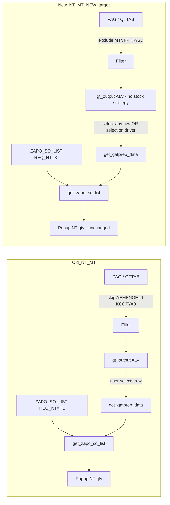

# ZGATPDB — New param: Stock strategy on popup only (not on dashboard)

**Program:** `ZAPO_GATP_ALLOCATION_REPORT`  
**Include:** `ZAPO_GATP_ALLOCATION_F005`  
**Param:** `ZAPOPARAM` — `NT_MT_NEW` + `REPORT_NEW` + `ACTIVE_FLAG = X`  
**Dashboard:** Daily Allocation vs Incoming Confirmed Sales Order Report (`display_data` → `gt_output`)  
**Popup:** gATP Manual & NO Touch Report (`get_gatprep_data` → `disp_mtch_ntch_per`)  
**Version:** 1.0 — 10/06/2026  

---

## 1. Required behaviour (from screenshots)

| View | Stock strategy material / `REQ_NT = 'KL'` order | Old `NT_MT` | New `NT_MT_NEW` (target) |
|------|--------------------------------------------------|-------------|---------------------------|
| **Initial dashboard (ALV)** | Must **not** appear | Correct — e.g. `B120MA` shows allocation only; KL qty **not** as a dashboard line | **Wrong today** — stock strategy row visible |
| **gATP MT/NT popup** | Must appear (NT/MT qty) | Correct — e.g. NT (Plant) PMR = **15**, PP = **15** | **Correct today** — keep as-is |

**Observation 1 (functional rule)**

> Stock strategy **material** and **`REQ_NT = 'KL'`** quantities belong **only in the popup**, not on the initial dashboard — same as Old param.

**Do not** add KL CVC rows to `gt_output` for ALV display under new param.  
**Do** keep `get_zapo_so_list` / SO `REQ_NT = 'KL'` path for popup totals.

---

## 2. Root cause — why New param shows stock strategy on dashboard

### 2.1 PAG build keeps rows Old param would skip (~917)

**Current code (`get_data`, PAG loop):**

```abap
IF lw_qttab-aemenge IS INITIAL AND p_report = abap_true.
  READ TABLE gt_zapoparam TRANSPORTING NO FIELDS
       WITH KEY param1 = 'GATP'.
  IF sy-subrc <> 0 AND lw_qttab-kcqty IS INITIAL.
    CLEAR: lw_dyn, lw_matloc, gw_matclass.
    CONTINUE.                    " Old param: skip zero incoming + zero alloc
  ENDIF.
ENDIF.
APPEND gw_output TO gt_output.    " New param: row kept → appears on dashboard
```

| Mode | `AEMENGE = 0`, `KCQTY = 0` | Stock strategy (`MTVFP = KP`) |
|------|----------------------------|-----------------------------|
| **Old** | Row **skipped** → not on dashboard | Not on dashboard |
| **New** | Row **kept** when `gt_zapoparam` filled | Shown on dashboard (**wrong**) |

Credit-block / NT-MT comment at line 915 intended to keep credit-block CVCs, but it also keeps **pure stock-strategy** PAG shells on the ALV.

### 2.2 No MTVFP guard before `APPEND gt_output`

`gt_matloc` is already read (~907) with `mtvfp`, but new param does **not** check **`KP` / `SD`** before appending to `gt_output`.

Per FS **BR6**, `MTVFP = KP/SD` identifies stock-strategy materials. They must be excluded from **dashboard** but remain in **`get_zapo_so_list`** for popup.

### 2.3 Prior fix direction was inverted

`merge_kl_so_cvc_to_output` into **`gt_output`** (earlier MD) would **add** KL lines to the dashboard. **Do not implement that** for this requirement. KL data must stay in **popup-only** path (`get_zapo_so_list`).

---

## 3. Old vs New — dashboard vs popup data flow



---

## 4. Code corrections (`ZAPO_GATP_ALLOCATION_F005`)

### 4.1 ADD helper — stock strategy material check

```abap
METHOD is_stock_strategy_matloc.
  IMPORTING
    iv_matnr TYPE /sapapo/matnr
    iv_locno TYPE /sapapo/locno
  RETURNING
    VALUE(rv_stock_strategy) TYPE abap_bool.

  READ TABLE gt_matloc INTO DATA(ls_matloc)
    WITH KEY matnr = iv_matnr
             locno = iv_locno BINARY SEARCH.
  IF sy-subrc = 0
     AND ( ls_matloc-mtvfp = 'KP' OR ls_matloc-mtvfp = 'SD' ).
    rv_stock_strategy = abap_true.
  ENDIF.
ENDMETHOD.
```

> `gt_matloc` is already populated in `get_data` before the PAG loop. Reuse it; no extra SELECT per row if table is sorted.

---

### 4.2 CHANGE J — PAG loop: exclude stock strategy from dashboard (New param only)

**Location:** `get_data`, immediately **before** `APPEND gw_output TO gt_output` (~966).

**Replace** block ~917–924 and add stock-strategy guard:

```abap
* Credit block / NT-MT: keep PAG CVC when AEMENGE=0 if quota exists.
* Stock strategy (KP/SD): popup only — never on dashboard (New param).
IF p_report = abap_true.
  READ TABLE gt_zapoparam TRANSPORTING NO FIELDS
       WITH KEY param1 = 'GATP'.
  IF sy-subrc = 0.
    " --- New NT_MT_NEW ---
    IF is_stock_strategy_matloc(
         iv_matnr = lw_dyn-rule_matnr
         iv_locno = lw_dyn-rule_werks ) = abap_true.
      CLEAR: lw_dyn, lw_matloc, gw_matclass, gw_output.
      CONTINUE.
    ENDIF.
    IF lw_qttab-aemenge IS INITIAL AND lw_qttab-kcqty IS INITIAL.
      CLEAR: lw_dyn, lw_matloc, gw_matclass, gw_output.
      CONTINUE.
    ENDIF.
  ELSE.
    " --- Old NT_MT (unchanged) ---
    IF lw_qttab-aemenge IS INITIAL AND lw_qttab-kcqty IS INITIAL.
      CLEAR: lw_dyn, lw_matloc, gw_matclass, gw_output.
      CONTINUE.
    ENDIF.
  ENDIF.
ENDIF.

APPEND gw_output TO gt_output.
```

**Effect**

- New param: **KP/SD** materials never reach `gt_output` → **not on dashboard**.
- New param: zero `AEMENGE` + zero `KCQTY` rows skipped (same as Old).
- New param: credit-block CVCs with **`KCQTY > 0`** still appear on dashboard (not stock strategy).
- Old param: logic unchanged.

---

### 4.3 CHANGE J — Post-filter `gt_output` before `display_data`

**Location:** end of `get_data`, before final `SORT` (~2997).

Safety net for rows added via BAPI enrichment / `gt_output_temp` append:

```abap
READ TABLE gt_zapoparam TRANSPORTING NO FIELDS WITH KEY param1 = 'GATP'.
IF sy-subrc = 0 AND p_report = abap_true.
  DELETE gt_output WHERE is_stock_strategy_matloc(
                         iv_matnr = material
                         iv_locno = location ) = abap_true.
ENDIF.
```

---

### 4.4 CHANGE K — `get_zapo_so_list`: keep `REQ_NT = 'KL'` for popup (KP bypass)

Stock-strategy lines must still enter **`gt_apo_so_list`** for popup.  
Apply if not already transported (~3224):

```abap
LOOP AT lt_apo_so_list INTO gw_apo_so_list.
  READ TABLE lt_matloc INTO lw_matloc
    WITH KEY matnr       = gw_apo_so_list-matnr
             locno       = gw_apo_so_list-werks
             planner_snp = gw_apo_so_list-spart BINARY SEARCH.
  IF sy-subrc EQ 0.
    APPEND gw_apo_so_list TO gt_apo_so_list.
  ELSEIF gw_apo_so_list-req_nt = 'KL'.
    APPEND gw_apo_so_list TO gt_apo_so_list.
  ENDIF.
  CLEAR gw_apo_so_list.
ENDLOOP.
```

**Do not** change `DELETE lt_matloc WHERE mtvfp EQ 'KP'` if used elsewhere; popup uses the `ELSEIF req_nt = 'KL'` branch.

---

### 4.5 CHANGE K — `get_zapo_so_list`: division range when `im_output` empty

When dashboard has **no** stock-strategy rows, `im_output` may not carry divisions. Build `lt_spart_r` from selection:

**Location:** after `lt_output = im_output` loop (~3059–3073):

```abap
IF lt_spart_r IS INITIAL AND so_divi[] IS NOT INITIAL.
  lt_spart_r = so_divi[].
ENDIF.
```

Ensures popup `SELECT` on `ZAPO_SO_LIST` still runs when user opens MT/NT report without a stock-strategy dashboard row.

---

### 4.6 CHANGE K — `get_gatprep_data`: popup without stock-strategy dashboard row

**Location:** `get_gatprep_data` (~6101–6106), after failed row selection.

When new param active and no row selected, build a **popup-only driver** from selection (not from `gt_output`):

```abap
READ TABLE lt_index TRANSPORTING NO FIELDS INDEX 1.
IF sy-subrc <> 0.
  READ TABLE gt_zapoparam TRANSPORTING NO FIELDS WITH KEY param1 = 'GATP'.
  IF sy-subrc = 0.
    PERFORM build_popup_driver_from_sel CHANGING lt_output.
    IF lt_output IS NOT INITIAL.
      " Continue to get_zapo_so_list — do not raise text-005
    ELSE.
      MESSAGE text-005 TYPE 'S' DISPLAY LIKE 'E'.
      gw_return = abap_true.
      RETURN.
    ENDIF.
  ELSE.
    MESSAGE text-005 TYPE 'S' DISPLAY LIKE 'E'.
    gw_return = abap_true.
    RETURN.
  ENDIF.
ENDIF.
```

**Form `build_popup_driver_from_sel`:**

```abap
FORM build_popup_driver_from_sel CHANGING ct_output TYPE gty_output_tab.
  DATA ls_out TYPE gty_output.
  FIELD-SYMBOLS <fs_div> LIKE LINE OF so_divi.

  CLEAR ct_output.
  LOOP AT so_divi ASSIGNING <fs_div>.
    CLEAR ls_out.
    ls_out-div   = <fs_div>-low.
    ls_out-date  = sy-datum.
    IF so_mat IS NOT INITIAL.
      READ TABLE so_mat ASSIGNING FIELD-SYMBOL(<fs_mat>) INDEX 1.
      IF sy-subrc = 0. ls_out-material = <fs_mat>-low. ENDIF.
    ENDIF.
    IF so_loc IS NOT INITIAL.
      READ TABLE so_loc ASSIGNING FIELD-SYMBOL(<fs_loc>) INDEX 1.
      IF sy-subrc = 0. ls_out-location = <fs_loc>-low. ENDIF.
    ENDIF.
    IF so_gc IS NOT INITIAL.
      READ TABLE so_gc ASSIGNING FIELD-SYMBOL(<fs_gc>) INDEX 1.
      IF sy-subrc = 0. ls_out-grp_cust = <fs_gc>-low. ENDIF.
    ENDIF.
    APPEND ls_out TO ct_output.
  ENDLOOP.
ENDFORM.
```

When user **does** select a normal dashboard row, existing loop (~6117) still sums grid `manual_touch` / `no_touch`; `get_zapo_so_list` **adds** stock-strategy KL NT (Old behaviour).

For **new param popup NT columns**, prefer SO bucket (if prior popup MD applied):

```abap
READ TABLE gt_zapoparam TRANSPORTING NO FIELDS WITH KEY param1 = 'GATP'.
IF sy-subrc = 0.
  gw_ntch_pp_plant  = gw_apo_so_nt_pp_plant.   " overwrite / SO source
  gw_ntch_tot_plant = gw_apo_so_nt_tot_plant.
  " ... depot + other divisions
ENDIF.
```

---

### 4.7 `collect_final_output` — backup only; do not restore dashboard rows

KL merge in `collect_final_output` (~3476) is for **`ZAPO_PRIME_BCKU` backup**, not ALV.

| Action | Dashboard `gt_output` | Backup `lt_output` |
|--------|----------------------|-------------------|
| **Do** | Exclude KP/SD (§4.2–4.3) | Keep KL merge for missing CVC keys if backup must store KL |
| **Do not** | `merge_kl_so_cvc_to_output` → `gt_output` | — |

If backup should also exclude pure stock-strategy shell rows, apply the same `is_stock_strategy_matloc` check before INSERT into `ZAPO_PRIME_BCKU`.

---

### 4.8 Revert / do not apply (conflicts with this requirement)

| Earlier recommendation | Action |
|------------------------|--------|
| `merge_kl_so_cvc_to_output` → **`gt_output`** in `get_data` | **Do not implement** |
| Keep AEMENGE=0 rows on dashboard when `gt_zapoparam` active | **Replaced** by §4.2 |

---

## 5. Test plan

| # | Config | Scenario | Dashboard (`gt_output`) | Popup |
|---|--------|----------|-------------------------|-------|
| T1 | Old `NT_MT` | `B120MA` / `3605` / Div `23` / GC `5000000617`, KL orders | Shows allocation row; **no** separate KL line | NT (Plant) = **15** (baseline) |
| T2 | New `NT_MT_NEW` — **after fix** | Same as T1 | Same as T1 — **no** stock-strategy-only row | NT (Plant) = **15** (unchanged) |
| T3 | New `NT_MT_NEW` | `H029SG` / `3925`, `MTVFP = KP`, `REQ_NT = KL` only | **Empty** / no KP material row | NT qty from `get_zapo_so_list` |
| T4 | New `NT_MT_NEW` | Credit block, `KCQTY > 0`, not KP | Row **visible** | CB qty in MT/NT per CHANGE F |
| T5 | New `NT_MT_NEW` | Open popup with no row selected; `so_divi` filled | — | Popup opens; SO KL totals > 0 |
| T6 | New `NT_MT_NEW` | Regular + UA released | Dashboard unchanged | MT from `ZAPO_ADB_ADJ`; NT KL unchanged |

**Checks in AD1**

```sql
-- Stock strategy material
SELECT matnr, locno, mtvfp
  FROM /sapapo/v_matloc
 WHERE matnr = '<material>' AND locno = '<plant>';

-- KL orders (popup source)
SELECT matnr, werks, gccode, req_nt, bmeng
  FROM zapo_so_list
 WHERE req_nt = 'KL' AND delind = space AND abgru = space;
```

---

## 6. Transport checklist

| # | Object | Change |
|---|--------|--------|
| 1 | `ZAPO_GATP_ALLOCATION_F005` | `is_stock_strategy_matloc` |
| 2 | Same | §4.2 PAG loop CONTINUE for KP/SD (new param) |
| 3 | Same | §4.3 DELETE post-filter on `gt_output` |
| 4 | Same | §4.4–4.5 `get_zapo_so_list` KP bypass + `so_divi` fallback |
| 5 | Same | §4.6 `build_popup_driver_from_sel` + relaxed selection for new param |
| 6 | `ZAPOPARAM` | `NT_MT_NEW` active; `NT_MT` inactive for test divisions |

---

## 7. Summary

| Question | Answer |
|----------|--------|
| Why does Old dashboard look correct? | Skips zero PAG rows; no explicit keep for `gt_zapoparam`; KL qty only via popup SO add-on |
| Why does New dashboard show stock strategy? | New param **keeps** zero / stock-strategy PAG rows on `gt_output` |
| Fix | Under `NT_MT_NEW`, **exclude `MTVFP = KP/SD`** from `gt_output`; keep **`get_zapo_so_list`** for popup |
| What stays the same? | Popup NT-MT quantities (already correct for new param) |

**Related MDs**

- `ZGATPDB_NT_MT_OLD_vs_NEW_KL_Stock_Strategy_Code_Correction.md` — popup KL parity (do **not** use dashboard merge from that doc)  
- `ZGATPDB_KL_REQ_NT_No_Data_Popup_Code_Correction.md` — KP bypass in `get_zapo_so_list` (still required for popup)  
- `FS_TS_NT_MT_Report_Revision.md` — BR6: KP/SD stock strategy definition  

---

*End of document*
