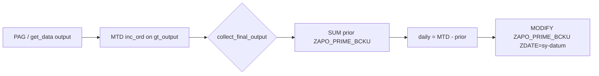

# ABAP code change — `ZAPO_PRIME_BCKU` daily quantities (not cumulative)

**Program:** `ZAPO_GATP_ALLOCATION_REPORT`  
**Include:** `ZAPO_GATP_ALLOCATION_F005`  
**T-code:** `ZGATPDB`  
**Table:** `ZAPO_PRIME_BCKU`  
**Version:** 1.0 — 20/05/2026  

---

## 1. Problem and target

| `ZDATE` | Current (wrong) | Target (daily) |
|---------|-----------------|----------------|
| 18.05.2026 | Inc 210, NT 210 | 210 / 210 |
| 19.05.2026 | Inc 210, NT 210 | **0 / 0** |
| 20.05.2026 | Inc 245, NT 245 | **35 / 35** |

**Rule:** Each backup row must store **only that run date’s increment**:

```text
daily_qty = MAX( 0, mtd_qty_from_output − SUM(qty already saved in ZAPO_PRIME_BCKU this month before sy-datum) )
```

---

## 2. Objects to change

| # | Object | Change |
|---|--------|--------|
| 1 | `ZAPO_GATP_ALLOCATION_F005` | New FORM `zapo_prime_bcku_daily_qty` |
| 2 | `ZAPO_GATP_ALLOCATION_F005` | `collect_final_output` — read prior MTD + call FORM before save |
| 3 | `ZAPO_GATP_ALLOCATION_F005` | `get_data` — optional daily `inc_ord_quan` in CHANGE F (recommended) |

**Do not change** `update_database` (still `MODIFY zapo_prime_bcku FROM lw_prime_buk`).

---

## 3. STEP 1 — Add FORM at end of include (before last `ENDCLASS` or after `collect_final_output`)

Place once in `ZAPO_GATP_ALLOCATION_F005` (local forms section / end of `lcl_gatp_alloc` implementation).

```abap
*&---------------------------------------------------------------------*
*& Form zapo_prime_bcku_daily_qty
*&  Convert MTD-style output qty to daily qty for ZAPO_PRIME_BCKU save
*&---------------------------------------------------------------------*
FORM zapo_prime_bcku_daily_qty
  USING    is_output     TYPE gty_output
           iv_prime_sto  TYPE zprime_sto
  CHANGING cv_inc_ord_quan TYPE zapo_prime_bcku-inc_ord_quan
           cv_manual_touch TYPE zapo_prime_bcku-manual_touch
           cv_no_touch     TYPE zapo_prime_bcku-no_touch.

  STATICS: st_mtd_sum TYPE HASHED TABLE OF lty_prime_mtd_sum
           WITH UNIQUE KEY material location div grp_cust dist_chan
                           region ship_to_party,
           sv_loaded TYPE dats,
           sv_sto    TYPE zprime_sto.

  DATA: lw_month_start TYPE datum,
        lv_yesterday   TYPE datum,
        lw_mtd         TYPE lty_prime_mtd_sum,
        lw_daily_inc   TYPE zapo_prime_bcku-inc_ord_quan,
        lw_daily_mt    TYPE zapo_prime_bcku-manual_touch,
        lw_daily_nt    TYPE zapo_prime_bcku-no_touch.

  TYPES: BEGIN OF lty_prime_mtd_sum,
           material      TYPE zapo_prime_bcku-material,
           location      TYPE zapo_prime_bcku-location,
           div           TYPE zapo_prime_bcku-div,
           grp_cust      TYPE zapo_prime_bcku-grp_cust,
           dist_chan     TYPE zapo_prime_bcku-dist_chan,
           region        TYPE zapo_prime_bcku-region,
           ship_to_party TYPE zapo_prime_bcku-ship_to_party,
           prior_inc     TYPE zapo_prime_bcku-inc_ord_quan,
           prior_mt      TYPE zapo_prime_bcku-manual_touch,
           prior_nt      TYPE zapo_prime_bcku-no_touch,
         END OF lty_prime_mtd_sum.

  " Reload prior-month sums once per day / prime_sto per run
  IF sv_loaded <> sy-datum OR sv_sto <> iv_prime_sto.
    CLEAR st_mtd_sum.
    CONCATENATE sy-datum+0(6) '01' INTO lw_month_start.
    lv_yesterday = sy-datum - 1.

    IF lv_yesterday >= lw_month_start.
      SELECT material location div grp_cust dist_chan region ship_to_party
             SUM( inc_ord_quan )  AS prior_inc
             SUM( manual_touch ) AS prior_mt
             SUM( no_touch )     AS prior_nt
        FROM zapo_prime_bcku
        INTO TABLE @st_mtd_sum
        WHERE prime_sto = @iv_prime_sto
          AND zdate BETWEEN @lw_month_start AND @lv_yesterday
          AND div IN @so_divi.
    ENDIF.
    sv_loaded = sy-datum.
    sv_sto    = iv_prime_sto.
  ENDIF.

  lw_daily_inc = is_output-inc_ord_quan.
  lw_daily_mt  = is_output-manual_touch.
  lw_daily_nt  = is_output-no_touch.

  READ TABLE st_mtd_sum INTO lw_mtd
    WITH KEY material      = is_output-material
             location      = is_output-location
             div           = is_output-div
             grp_cust      = is_output-grp_cust
             dist_chan     = is_output-dist_chan
             region        = is_output-region
             ship_to_party = is_output-ship_to_party.
  IF sy-subrc = 0.
    lw_daily_inc = lw_daily_inc - lw_mtd-prior_inc.
    lw_daily_mt  = lw_daily_mt  - lw_mtd-prior_mt.
  ENDIF.

  IF lw_daily_inc < 0. CLEAR lw_daily_inc. ENDIF.
  IF lw_daily_mt  < 0. CLEAR lw_daily_mt.  ENDIF.

  " NT from daily inc − daily MT (BR2); manual_touch from ADB is already daily
  lw_daily_nt = lw_daily_inc - lw_daily_mt.
  IF lw_daily_nt < 0. CLEAR lw_daily_nt. ENDIF.

  cv_inc_ord_quan = lw_daily_inc.
  cv_manual_touch = lw_daily_mt.
  cv_no_touch     = lw_daily_nt.

ENDFORM.
```

> **Note:** If your system does not allow `TYPES` inside FORM, move `lty_prime_mtd_sum` to the top of the include (with other local types) and remove the inner `TYPES` block.

---

## 4. STEP 2 — `collect_final_output` (mandatory)

**Location:** Method `collect_final_output`, after `lw_sto` is set and before `LOOP AT lt_output INTO gw_output`.

### 4.1 DELETE — direct MTD assign (UPDATE branch, ~line 3604–3607)

**Before:**

```abap
        <lfs_prime_buk>-inc_ord_quan =  gw_output-inc_ord_quan .
        <lfs_prime_buk>-bal_quan =  gw_output-bal_quan .
        <lfs_prime_buk>-manual_touch =  gw_output-manual_touch .
        <lfs_prime_buk>-no_touch =  gw_output-no_touch .
```

**After:**

```abap
        <lfs_prime_buk>-bal_quan = gw_output-bal_quan.

        PERFORM zapo_prime_bcku_daily_qty
          USING    gw_output
                   lw_sto
          CHANGING <lfs_prime_buk>-inc_ord_quan
                   <lfs_prime_buk>-manual_touch
                   <lfs_prime_buk>-no_touch.
```

### 4.2 DELETE — direct MTD assign (INSERT branch, ~line 3658–3661)

**Before:**

```abap
        gw_prime_buk_t-inc_ord_quan =  gw_output-inc_ord_quan .
        gw_prime_buk_t-bal_quan =  gw_output-bal_quan .
        gw_prime_buk_t-manual_touch =  gw_output-manual_touch .
        gw_prime_buk_t-no_touch =  gw_output-no_touch .
```

**After:**

```abap
        gw_prime_buk_t-bal_quan = gw_output-bal_quan.

        PERFORM zapo_prime_bcku_daily_qty
          USING    gw_output
                   lw_sto
          CHANGING gw_prime_buk_t-inc_ord_quan
                   gw_prime_buk_t-manual_touch
                   gw_prime_buk_t-no_touch.
```

---

## 5. STEP 3 — `get_data` CHANGE F (recommended, optional but aligns ALV + backup)

Apply in **each** CHANGE F block where credit block is added and **before** MT from `ZAPO_ADB_ADJ` / NT calculation.  
Search: `"Add credit block orders to PAG AEMENGE (BR5)"`.

**Insert immediately after** `inc_ord_quan = inc_ord_quan + lw_cb_qty` (and still inside plant `IF lw_loc_type_c = '1001'` where `lw_saved_mtd` is available):

```abap
*--- Daily incoming for today (not cumulative MTD) — BR4 daily save
                        IF lw_saved_mtd > 0.
                          <fs_output>-inc_ord_quan =
                            <fs_output>-inc_ord_quan - lw_saved_mtd.
                          IF <fs_output>-inc_ord_quan < 0.
                            CLEAR <fs_output>-inc_ord_quan.
                          ENDIF.
                        ENDIF.

                        lw_remaining = lw_so_cap_qty - lw_saved_mtd.
                        IF lw_remaining < 0.
                          CLEAR lw_remaining.
                        ENDIF.
                        IF lw_so_cap_qty > 0
                       AND <fs_output>-inc_ord_quan > lw_remaining.
                          <fs_output>-inc_ord_quan = lw_remaining.
                        ENDIF.
```

Then keep existing MT / NT logic:

```abap
* MT from ZAPO_ADB_ADJ ...
* NT = inc_ord_quan - manual_touch
```

Repeat for the **second** parallel CHANGE F branch (~2675) and **`p_np`** block (~2901) if present.

---

## 6. Flow after fix



---

## 7. Test plan

| ID | Steps | Expected `ZAPO_PRIME_BCKU` |
|----|-------|----------------------------|
| T1 | Run backup 18.05, MTD inc = 210 | `ZDATE=18.05`, `INC_ORD_QUAN=210`, `NO_TOUCH=210` |
| T2 | Run 19.05, no new PAG qty | `ZDATE=19.05`, `INC_ORD_QUAN=0`, `NO_TOUCH=0` |
| T3 | Run 20.05, MTD inc = 245 | `ZDATE=20.05`, `INC_ORD_QUAN=35`, `NO_TOUCH=35` |
| T4 | `SUM(INC_ORD_QUAN)` for month | **245** (210+0+35), not 210+210+245 |

---

## 8. Transport checklist

- [ ] Add FORM `zapo_prime_bcku_daily_qty` in `ZAPO_GATP_ALLOCATION_F005`
- [ ] Update `collect_final_output` (2 PERFORM calls)
- [ ] Optional: `get_data` CHANGE F daily delta (3 places if `p_np` block exists)
- [ ] Activate report; syntax check
- [ ] SE16: verify by `ZDATE` after test runs
- [ ] Functional: correct existing wrong May rows or wait for next month start

---

## 9. Related fixes (separate MD files)

| Topic | File |
|-------|------|
| SORG 1020 / GP block, NT DLBL FL/BE/OI/DZ | `ZGATPDB_SORG1020_DLBL_NT_MT_Code_Correction.md` |
| Analysis / background | `ZGATPDB_PRIME_BCKU_Daily_Quantity_Code_Correction.md` |

---

*Source reference: AD1 `ZAPO_GATP_ALLOCATION_F005` — `collect_final_output` lines ~3534–3677, `get_data` CHANGE D/F.*
