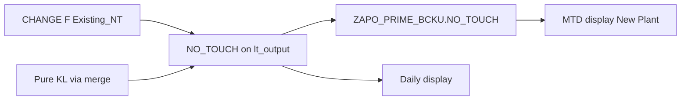

# Implementation Guide — Stock Strategy KL into `NO_TOUCH` / `ZAPO_PRIME_BCKU`

**System:** DEVSCMAD1 (validated via AD1 MCP 04/08/2026)  
**Program / Include:** `ZAPO_GATP_ALLOCATION_REPORT` / `ZAPO_GATP_ALLOCATION_F005`  
**T-code:** `ZGATPDB`  
**Param scope:** **New only** (`gt_zapoparam` `param1 = 'GATP'`)  
**Version:** 1.1 — 04/08/2026  

---

## A. Requirement (authoritative)

| # | Requirement | Meaning |
|---|-------------|---------|
| R1 | Store Stock Strategy (`REQ_NT = 'KL'`) in **No Touch** | `NO_TOUCH` in `ZAPO_PRIME_BCKU` = **existing NO_TOUCH logic + KL quantity** |
| R2 | Same value for **display** | Daily / MTD popup NT must read the same stored / computed `NO_TOUCH` (no parallel “KL-only side path” that disagrees with backup) |
| R3 | **Do not disturb** existing report generation | Keep CHANGE F Plant formula, Old param, Depot legacy, RDD filters, ALV build — only open the backup exclude and align MTD so KL is not double-counted |

```text
NO_TOUCH (store + display) = Existing_NT + KL_qty
```

| Case | Existing_NT | KL_qty | Result |
|------|-------------|--------|--------|
| Allocation CVC only | From current CHANGE F | 0 | Unchanged |
| Pure Stock Strategy CVC | 0 | KL | `NO_TOUCH = KL` → must be **saved** |
| Same CVC with Alloc + KL | CHANGE F already uses month SO WMENG incl. KL | (already inside Existing_NT) | Save as today — **do not add KL again** |

---

## B. Fit analysis — previous guide vs this requirement (AD1 live)

### B.1 What AD1 does today

| Layer | Live behaviour | Fits R1–R3? |
|-------|----------------|-------------|
| CHANGE F Plant NT | `NO_TOUCH = month WMENG (Z1/KSV/**KL**) − MTD(BCKU MT+NT) − ADB MT` | Existing logic **already includes KL in SO** for CVCs on the grid |
| `collect_final_output` **FIX-KL-BAK Obs2** | Pure KL (`ALLOC=0`, no UA) → **`CONTINUE`** — never write BCKU; merge only fills `lt_kl_chk` | **Fails R1** |
| Daily popup **FIX-KL-POP** | Adds KL from `gt_fetch_outtab` for CVCs missing on grid | Display has KL; backup does not → **Fails R2** |
| MTD `pull_data_prime_buck` | BCKU + KL SO additive (because Obs2 said KL not in BCKU) | Needed today; **must change** once KL is in BCKU or **Fails R2** (double) |

### B.2 Previous guide (v1.0) scorecard

| Step | Intent | Fit to R1–R3 | Verdict |
|------|--------|--------------|---------|
| **SS1A** Old-only exclude | Allow New to save pure KL | **Required for R1** | **Keep** |
| **SS1B** Append missing KL CVCs to `lt_output` | Pure KL not on grid still backs up | **Required for R1** | **Keep** (move before FAE SELECT) |
| **SS2** Net KL with `SELECT SUM(BCKU)` inside `merge_kl` | Mid-month / reappear control | **Over-engineered for R1** — can change popup qty path; risks confusing “existing + KL” | **Simplify / optional** — prefer save **Existing_NT + KL** without new SELECT in merge |
| **SS3** Stop Plant New MTD KL SO add | Avoid BCKU + SO double | **Required for R2** once KL in BCKU | **Keep** |

### B.3 Gaps vs “existing + KL”

1. **SS2 as written** replaces KL with `KL − MTD BCKU` inside `merge_kl`. That is useful for pure-KL shells, but it is **not** the same wording as “existing logic + KL”, and it touches a method also used for **display** (FIX-KL-POP). Prefer: **do not change merge qty formula** unless needed; store whatever `no_touch` already is on the row (CHANGE F or merge’s current KL sum).  
2. Guide did **not** say explicitly: for CVCs **already** on `lt_output`, **never add KL twice** (CHANGE F already counted KL in WMENG). SS1B already skips existing keys — keep that.  
3. **R3**: Do **not** change CHANGE F, `get_data` ALV, Old param, Depot SO add.

---

## C. Target design (minimal disturbance)

```text
Backup (New):
  1. Keep existing lt_output NO_TOUCH from CHANGE F  (already Existing + KL in SO formula)
  2. Remove New-param Obs2 skip so those rows SAVE
  3. Append pure-KL CVCs missing from lt_output with no_touch = KL (merge_kl current qty)
  4. MODIFY ZAPO_PRIME_BCKU.NO_TOUCH as today

Display:
  Daily: grid NO_TOUCH + FIX-KL-POP for missing KL CVCs (unchanged structure)
  MTD New Plant: SUM(BCKU) only — SS3 stops SO KL add
  MTD Old / Depot: unchanged
```



---

## 0. Purpose (implementation)

| ID | Method | What | Disturbs existing report? |
|----|--------|------|---------------------------|
| **SS1** | `collect_final_output` | Save KL into `NO_TOUCH` (allow + append) | **No** — backup only |
| **SS3** | `pull_data_prime_buck` | New Plant MTD from BCKU only | **No** for Old/Depot; aligns New Plant display with store |
| **SS2** | `merge_kl` | **Optional** — only if pure-KL popup must net prior BCKU | Avoid unless T2 fails |

**Do not touch:** CHANGE F, Old Obs2 behaviour (keep for Old), Depot KL add, RDD filters, FIX-KL-POP loop structure.

---

## 1. Pre-checks

| # | Check | How |
|---|--------|-----|
| 1 | Open `ZAPO_GATP_ALLOCATION_F005` on AD1 | SE80 / ADT |
| 2 | Confirm `FIX-KL-BAK` / `lt_kl_chk` | Search |
| 3 | Confirm MTD comment Obs2 | Search `KL not in ZAPO_PRIME_BCKU` |
| 4 | Transport | Workbench TR — include only |
| 5 | Test CVC | Plant `1001`, `REQ_NT='KL'`, `BMENG>0`, `EDATU=sy-datum` |

---

## 2. Implementation order

```text
1) SS1  — collect_final_output (R1 store)
2) SS3  — pull_data_prime_buck (R2 no double MTD)
3) Syntax check → activate
4) Test T1–T6
5) SS2 only if T2 (next-day reappear) fails for pure KL
```

---

## 3. STEP SS1 — Store KL in `NO_TOUCH` via backup

### 3.1 SS1A — Old-only exclude (New must save)

**Find:**

```abap
*--- Pure stock-strategy KL: no PAG / no UA -> never write ZAPO_PRIME_BCKU
```

**Replace CONTINUE block with:**

```abap
*--- SS1A: Old only — exclude pure KL from BCKU (legacy)
*--- New: store Existing_NT + KL in NO_TOUCH (R1)
      READ TABLE gt_zapoparam TRANSPORTING NO FIELDS
        WITH KEY param1 = 'GATP'.
      IF sy-subrc <> 0.
        IF lv_kl_hit = abap_true
           AND gw_output-alloc_quan   = 0
           AND gw_output-manual_touch = 0
           AND gw_output-p_usr_adj    = 0.
          CONTINUE.
        ENDIF.
      ENDIF.
```

Effect: rows already on `lt_output` keep **existing** `no_touch` (CHANGE F = existing + KL in SO) and are **written** to `ZAPO_PRIME_BCKU-NO_TOUCH`.

### 3.2 SS1B — Append pure-KL CVCs missing from `lt_output`

**Place after `SORT lt_kl_chk ...` and BEFORE `lt_ouput_t = lt_output` / FAE SELECT.**

```abap
*--- SS1B: New — pure KL CVC not on grid → still backup NO_TOUCH = KL
    READ TABLE gt_zapoparam TRANSPORTING NO FIELDS
      WITH KEY param1 = 'GATP'.
    IF sy-subrc = 0 AND lt_kl_chk IS NOT INITIAL.
      SORT lt_output BY material location dist_chan div grp_cust.
      LOOP AT lt_kl_chk INTO lw_kl_chk.
        READ TABLE lt_output TRANSPORTING NO FIELDS
          WITH KEY material  = lw_kl_chk-material
                   location  = lw_kl_chk-location
                   dist_chan = lw_kl_chk-dist_chan
                   div       = lw_kl_chk-div
                   grp_cust  = lw_kl_chk-grp_cust
          BINARY SEARCH.
        IF sy-subrc <> 0.
*--- Do NOT add KL onto existing keys (would double — CHANGE F already has KL)
          lw_kl_chk-date = sy-datum.
          APPEND lw_kl_chk TO lt_output.
        ENDIF.
      ENDLOOP.
    ENDIF.
```

`lw_kl_chk-no_touch` already set by current `merge_kl` (= KL sum). That is **Existing(0) + KL**.

### 3.3 Method order (mandatory)

```text
1. merge_kl → lt_kl_chk
2. SS1B append into lt_output
3. lt_ouput_t = lt_output + SELECT today BCKU
4. LOOP save → SS1A Old exclude only
```

### 3.4 Comment update

```abap
*--- SS1: KL via merge — New appends missing CVCs for NO_TOUCH backup; Old keeps Obs2 exclude
```

---

## 4. STEP SS3 — Display MTD uses stored `NO_TOUCH` (no double)

**Find:**

```abap
*--- New param: KL not in ZAPO_PRIME_BCKU (Obs2) -> add from SO like old
```

**In both** `lt_apo_so_list_mt` and `lt_apo_so_list_nt` loops, after `loc_type` known:

```abap
*--- SS3: New Plant — KL already in BCKU.NO_TOUCH → do not add SO again (R2)
            IF lv_new_gatp_param = abap_true
            AND gw_loc_type_sto-loc_type = '1001'.
              CONTINUE.
            ENDIF.
```

| Case | After SS3 |
|------|-----------|
| New Plant | MTD NT = SUM(BCKU.NO_TOUCH) — same as stored |
| New Depot / Old | Unchanged SO KL add |

---

## 5. STEP SS2 — Optional only

**Do not implement SS2 (MTD SELECT netting inside `merge_kl`) in the first transport** unless:

- Pure KL next-day popup still reappears after SS1+SS3, **and**
- Product accepts netting inside merge for FIX-KL-POP.

Rationale for R1/R3: CHANGE F already nets MTD BCKU for grid CVCs; SS2 is extra surface area on a shared display method.

If later needed, use the SS2 block from analysis doc v2 — not required for “store existing + KL”.

---

## 6. What must stay untouched (R3)

| Object / logic | Action |
|----------------|--------|
| CHANGE F Plant NT formula | **No change** |
| CHANGE-P1 Plant-only / Depot Old | **No change** |
| KL RDD Plant filters | **No change** |
| Old param Obs2 exclude | **Kept** via SS1A |
| Old / Depot MTD KL SO add | **Kept** |
| FIX-KL-POP loop structure | **No change** (still sums `gt_fetch_outtab`) |
| Dashboard ALV build | **No change** |

---

## 7. Test plan

| ID | Steps | Pass |
|----|--------|------|
| **T1** | New Plant pure KL + Backup | `ZAPO_PRIME_BCKU-NO_TOUCH` = KL qty (> 0) |
| **T2** | Allocation-only CVC backup | `NO_TOUCH` same as before SS1 (regression) |
| **T3** | CVC with Alloc + KL | `NO_TOUCH` = CHANGE F value; **not** CHANGE F + KL again |
| **T4** | Daily popup | NT matches stored / grid + FIX-KL-POP; no new side formula |
| **T5** | MTD New Plant | = SUM(BCKU); **not** BCKU + SO KL |
| **T6** | Old param | Pure KL still excluded from BCKU; MTD still SO-adds KL |

```sql
SELECT zdate, material, location, no_touch, manual_touch, alloc_quan
  FROM zapo_prime_bcku
 WHERE material = '<MAT>' AND location = '<WERKS>'
 ORDER BY zdate;
```

---

## 8. Rollback

| Symptom | Action |
|---------|--------|
| MTD Plant doubled | Ensure SS3 in both loops |
| KL missing in BCKU | SS1B before FAE; SS1A not skipping New |
| Alloc NT changed | Revert any accidental CHANGE F / SS2 edits |
| Full rollback | Revert F005 TR |

---

## 9. Sign-off checklist

- [ ] SS1A — New saves pure KL `NO_TOUCH`
- [ ] SS1B — append before FAE; no double-add on existing keys
- [ ] SS3 — New Plant MTD no SO KL add (MT + NT loops)
- [ ] SS2 **not** in first TR (unless T2 fails)
- [ ] T1–T6 passed
- [ ] Old / Depot smoke OK
- [ ] CHANGE F / report generation unchanged

---

## 10. Summary verdict

| Requirement | Guide alignment |
|-------------|-----------------|
| R1 Store KL in `NO_TOUCH` (= existing + KL) | **SS1** delivers; CHANGE F already embeds KL for grid CVCs |
| R2 Same for display | **SS3** makes MTD use BCKU; daily FIX-KL-POP kept |
| R3 Do not disturb report generation | **Do not** change CHANGE F; **defer SS2**; Old/Depot untouched |

**Previous v1.0 over-weighted SS2 netting.** For this requirement, ship **SS1 + SS3** only.

---

*End of Implementation Guide v1.1*
