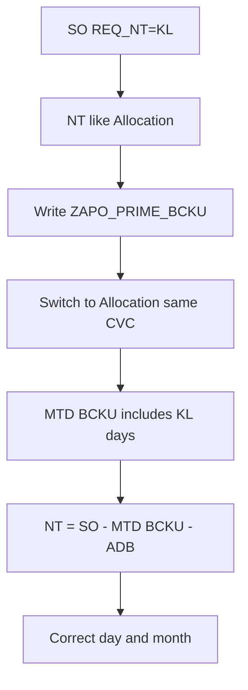

# ZGATPDB — Include Stock Strategy (`REQ_NT='KL'`) in `ZAPO_PRIME_BCKU` (mid-month KL ↔ Allocation)

**System:** DEVSCMAD1 — **live AD1 verified 04/08/2026** (`get_include_source_mcp` / `ZAPO_GATP_ALLOCATION_F005`)  
**Program:** `ZAPO_GATP_ALLOCATION_REPORT` / **T-code:** `ZGATPDB`  
**Param:** **New only** — `NT_MT_NEW` / `REPORT_NEW` (`gt_zapoparam` `param1 = 'GATP'`)  
**Tables:** `ZAPO_PRIME_BCKU`, `ZAPO_SO_LIST`  
**Do not change:** Old `NT_MT` paths, Plant-only CHANGE-P1/P3, Depot Old, KL RDD Plant filters, daily Incoming / WMENG NT formula already live  
**Version:** 2.0 — 04/08/2026 (AD1 live)  

> **Supersedes (New param backup policy):**  
> `ZGATPDB_NewParam_Backup_Exclude_StockStrategy_KL_Code_Correction.md`  
> and live comment **FIX-KL-BAK Obs2** (“KL never write `ZAPO_PRIME_BCKU`”).

---

## 1. Requirement

| Item | Detail |
|------|--------|
| Scenario | Material can change **Stock Strategy ↔ Allocation Strategy** **within the same month** |
| Problem | New Param NT = **SO − backup (`ZAPO_PRIME_BCKU`)**; KL is in **NT popup / MTD**, but **not** in backup → after switch, history is wrong |
| Target | While KL: backup NT **like Allocation**; after switch: prior NT/MT **intact** in BCKU; day / month use same netting |
| Constraints | No impact to other New Param CRs; **Old param untouched** |

---

## 2. AD1 live root cause (verified)

### 2.1 Backup explicitly skips pure Stock Strategy — `collect_final_output` ~4490–4509

```abap
*--- FIX-KL-BAK Obs2: KL list via EXISTING merge - do NOT append to lt_output
merge_kl_so_cvc_to_output( ... CHANGING ct_output = lt_kl_chk ).  " check list only

LOOP AT lt_output INTO gw_output.
*--- Pure stock-strategy KL: no PAG / no UA -> never write ZAPO_PRIME_BCKU
  IF lv_kl_hit = abap_true
     AND gw_output-alloc_quan   = 0
     AND gw_output-manual_touch = 0
     AND gw_output-p_usr_adj    = 0.
    CONTINUE.   " ← KL history never saved
  ENDIF.
  ...
ENDLOOP.
```

| Effect | Result |
|--------|--------|
| Pure KL CVC on grid (`ALLOC=0`, no UA) | **Skipped** — no BCKU row |
| Pure KL **not** on `lt_output` | Never enters save loop — merge only fills `lt_kl_chk` |
| Allocation CVC | Saved normally |

### 2.2 Daily / monthly still **add** KL from SO

| Path | Live behaviour |
|------|----------------|
| Daily popup `get_gatprep_data` | **FIX-KL-POP Obs1** — sums `gt_fetch_outtab` KL `no_touch` into `gw_ntch_*` |
| MTD `pull_data_prime_buck` ~4708 | Comment: *“New param: KL not in ZAPO_PRIME_BCKU (Obs2) → add from SO like old”* — **BCKU + KL SO additive** |

So: **NT display includes KL; backup does not** → mid-month switch breaks Plant New formula.

### 2.3 Plant New NT formula (unchanged — must keep)

```text
Incoming = lt_so_daily_inc_sum (window, Z1/KSV/KL)
NT      = lt_so_wmeng_sum (month WMENG, incl. KL)
        − SUM(BCKU manual_touch + no_touch) MTD prior
        − current ADB manual_touch
```

(`CHANGE F` ~2697–2771 — Plant `1001` only)

If KL days are missing from BCKU, `SUM(BCKU)` is understated → **NT overstated** after strategy change (or double-counts vs MTD SO add).

---

## 3. Additional facts to consider

| # | Fact | Recommendation |
|---|------|----------------|
| F1 | Backup key = **CVC** (mat/loc/div/gc/…), not `REQ_NT` | History survives KL↔Z1 if KL days are written |
| F2 | Removing only `CONTINUE` is **not enough** | Pure KL often **absent** from `lt_output` — must **append** KL CVCs into backup path |
| F3 | After KL is in BCKU, MTD **must stop** Plant New KL SO add | Else **double count** (BCKU + SO) |
| F4 | Daily FIX-KL-POP raw KL vs Plant netted NT | After include: pure-KL backup/popup qty should use **same netting** as Allocation (SO − MTD BCKU − ADB), not raw window sum alone |
| F5 | Depot / Old | Keep Obs2 exclude + SO KL add for **Old**; Depot may stay legacy — **do not** open New CB/UA for Depot |
| F6 | KL RDD Plant (`edatu = sy-datum`) | Keep; backup daily/popup Plant KL still RDD-day |
| F7 | Cutover | Prior month days without KL in BCKU cannot auto-heal |
| F8 | `REQ_MT='KL'` | Optional later; this CR focuses **REQ_NT / NO_TOUCH** |

---

## 4. Target behaviour (New param)

```text
While REQ_NT = KL (Plant):
  Compute NT like Allocation → write NO_TOUCH / INC to ZAPO_PRIME_BCKU (ZDATE = today)

After switch to Allocation (same CVC):
  mt_prime_bcku_sum already includes prior KL days
  → NT = month SO − MTD(MT+NT) − ADB MT   (unchanged formula)

MTD popup New Plant:
  SUM(BCKU) only — no KL SO additive

Old param:
  Unchanged (keep exclude + SO KL add)
```

---

## 5. Code corrections — New param only

### 5.1 CHANGE-SS1 — `collect_final_output`: allow KL backup + append missing KL CVCs

**A. Gate Obs2 exclude to Old param only** (~4492):

```abap
*--- Old param only: pure KL never in ZAPO_PRIME_BCKU (legacy Obs2)
READ TABLE gt_zapoparam TRANSPORTING NO FIELDS WITH KEY param1 = 'GATP'.
IF sy-subrc <> 0.
  IF lv_kl_hit = abap_true
     AND gw_output-alloc_quan   = 0
     AND gw_output-manual_touch = 0
     AND gw_output-p_usr_adj    = 0.
    CONTINUE.
  ENDIF.
ENDIF.
*--- New param: do NOT skip — Stock Strategy must backup (mid-month switch)
```

**B. After `merge_kl` → `lt_kl_chk`, for New param append missing KL CVCs into `lt_output` before save loop:**

```abap
READ TABLE gt_zapoparam TRANSPORTING NO FIELDS WITH KEY param1 = 'GATP'.
IF sy-subrc = 0.
  SORT lt_output BY material location dist_chan div grp_cust.
  LOOP AT lt_kl_chk INTO lw_kl_chk.
    READ TABLE lt_output TRANSPORTING NO FIELDS
      WITH KEY material  = lw_kl_chk-material
               location  = lw_kl_chk-location
               dist_chan = lw_kl_chk-dist_chan
               div       = lw_kl_chk-div
               grp_cust  = lw_kl_chk-grp_cust
      BINARY SEARCH.
    IF sy-subrc <> 0.
*--- Netted qty already on lw_kl_chk from merge_kl (see §5.2)
      lw_kl_chk-date = sy-datum.
      APPEND lw_kl_chk TO lt_output.
    ENDIF.
  ENDLOOP.
ENDIF.
```

Keep existing save of `inc_ord_quan` / `manual_touch` / `no_touch` as-is.

---

### 5.2 CHANGE-SS2 — `merge_kl_so_cvc_to_output`: New Plant qty = **netted** NT (align Allocation)

**Location:** ~3800–3812 (when `lv_new_param = abap_true`).

Today: raw `SUM(bmeng)`.  
Target for **Plant** rows: same idea as CHANGE F:

```text
no_touch = MAX( 0, month_KL_WMENG_or_BMENG − MTD(BCKU MT+NT) − ADB_MT )
```

Minimal safe approach (reuse existing buffers if in scope; else SELECT):

```abap
IF lv_new_param = abap_true.
  CLEAR lv_so_nt_kl.
  LOOP AT lt_fetch_all INTO lw_fetch_sum
    WHERE matnr  = lw_fetch_outtab-material
      AND werks  = lw_fetch_outtab-location
      AND vtweg  = lw_fetch_outtab-dist_chan
      AND spart  = lw_fetch_outtab-div
      AND gccode = lw_fetch_outtab-grp_cust.
    lv_so_nt_kl = lv_so_nt_kl + lw_fetch_sum-bmeng.  " already RDD-filtered for Plant
  ENDLOOP.

*--- Subtract MTD prior backup (month start .. yesterday) — same spirit as mt_prime_bcku_sum
  CLEAR lv_saved_prime.
  CONCATENATE sy-datum+0(6) '01' INTO lv_month_start.
  lv_yesterday = sy-datum - 1.
  IF lv_yesterday >= lv_month_start.
    SELECT SUM( manual_touch ) SUM( no_touch )
      INTO (lv_sum_mt, lv_sum_nt)
      FROM zapo_prime_bcku
      WHERE zdate BETWEEN lv_month_start AND lv_yesterday
        AND material  = lw_fetch_outtab-material
        AND location  = lw_fetch_outtab-location
        AND div       = lw_fetch_outtab-div
        AND grp_cust  = lw_fetch_outtab-grp_cust
        AND dist_chan = lw_fetch_outtab-dist_chan.
    lv_saved_prime = lv_sum_mt + lv_sum_nt.
  ENDIF.

  IF lv_so_nt_kl > lv_saved_prime.
    lv_so_nt_kl = lv_so_nt_kl - lv_saved_prime.
  ELSE.
    CLEAR lv_so_nt_kl.
  ENDIF.

  lw_fetch_outtab-no_touch     = lv_so_nt_kl.
  lw_fetch_outtab-inc_ord_quan = lv_so_nt_kl.
  CLEAR lw_fetch_outtab-manual_touch.
ENDIF.
```

**Prefer:** avoid per-row SELECT — pass `mt_prime_bcku_sum` / hashed MTD into merge or net once in `collect_final_output` after append.

**Depot / Old branches of `merge_kl`:** unchanged.

---

### 5.3 CHANGE-SS3 — `pull_data_prime_buck`: New Plant — **no** KL SO add (KL now in BCKU)

**Location:** ~4708–4812.

Today both params always add KL from SO.  
After SS1/SS2, New **Plant** would double-count.

```abap
*--- After Stock Strategy is in ZAPO_PRIME_BCKU (New Plant):
*---   MTD = BCKU only for Plant
*--- Depot / Old: keep KL SO additive (unchanged)

LOOP AT lt_apo_so_list_nt ...
  IF lv_new_gatp_param = abap_true
  AND gw_loc_type_sto-loc_type = '1001'.
    CONTINUE.   " do not add Plant KL from SO — already in BCKU
  ENDIF.
  " existing lv_kl_take / qty add for Depot and Old
ENDLOOP.
```

Apply same for `lt_apo_so_list_mt` if `REQ_MT='KL'` is added via SO for Plant New.

**Do not** remove Depot / Old additive.

---

### 5.4 CHANGE-SS4 — Daily popup FIX-KL-POP (optional harden)

`get_gatprep_data` ~7578 already sums `gt_fetch_outtab`. After §5.2 netting, that sum is **netted** — leave structure as-is.

**Do not** re-enable New param `gw_apo_so_nt_*` additive for Allocation CVCs.

---

### 5.5 Explicitly do **not** change

| Area | Action |
|------|--------|
| CHANGE F Plant formula (WMENG − MTD BCKU − ADB) | Untouched |
| CHANGE-P1 Plant-only / Depot Old | Untouched |
| KL RDD Plant filters | Untouched |
| Old param Obs2 exclude | **Kept** (§5.1 A) |
| Old MTD KL SO add | **Kept** (§5.3) |

---

## 6. Flow after fix



---

## 7. Test plan

| # | Scenario | Expected |
|---|----------|----------|
| T1 | New Plant, pure KL today, Backup | Row in `ZAPO_PRIME_BCKU` with `NO_TOUCH` > 0 |
| T2 | Next day same KL demand | NT nets via MTD BCKU — no full reappear |
| T3 | Mid-month KL → Allocation | Prior KL BCKU rows remain; new NT uses same formula |
| T4 | Mid-month Allocation → KL | Continues writing BCKU; history intact |
| T5 | New Plant MTD popup | **No** double count (BCKU only for Plant KL) |
| T6 | Old param backup / MTD | **Unchanged** (exclude + SO KL add) |
| T7 | Depot New | Legacy KL path unchanged |

**SQL**

```sql
SELECT zdate, material, location, no_touch, manual_touch, inc_ord_quan, alloc_quan
  FROM zapo_prime_bcku
 WHERE material = '<MAT>'
   AND location = '<WERKS>'
 ORDER BY zdate;

SELECT edatu, req_nt, bmeng, wmeng, vbeln
  FROM zapo_so_list
 WHERE matnr = '<MAT>' AND werks = '<WERKS>'
   AND delind = ' ' AND abgru = ' '
 ORDER BY edatu, req_nt;
```

---

## 8. Transport checklist

| # | Object | Change |
|---|--------|--------|
| 1 | `ZAPO_GATP_ALLOCATION_F005` | §5.1 — Old-only exclude; New append KL to backup |
| 2 | Same | §5.2 — merge_kl New Plant netted qty |
| 3 | Same | §5.3 — MTD New Plant stop KL SO add |
| 4 | Test | T1–T6 |

---

## 9. Summary

| Question | Answer |
|----------|--------|
| Why wrong on KL↔Alloc? | Live **FIX-KL-BAK Obs2** keeps KL out of BCKU while popup/MTD still count KL |
| Fix | **Include** KL in BCKU (New); **stop** Plant New MTD KL SO add; net merge qty like Allocation |
| More facts? | §3 — append missing CVCs, avoid double MTD, Old/Depot untouched, cutover |
| Old / other New CRs | Untouched |

---

*End of document — AD1 live 04/08/2026*
