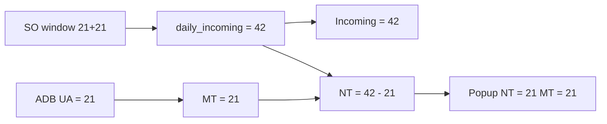

# ZGATPDB — UA/MT clears NT in popup; NT must be Incoming − MT (42 − 21 = 21)

**System:** DEVSCMAD1 (`ZAPO_GATP_ALLOCATION_F005` — last verified live source; AD1 MCP unavailable at write time)  
**Program:** `ZAPO_GATP_ALLOCATION_REPORT` / **T-code:** `ZGATPDB`  
**Param:** `NT_MT_NEW` / `REPORT_NEW`  
**Tables:** `ZAPO_SO_LIST`, `ZAPO_ADB_ADJ`  
**Popup:** gATP Manual & NO Touch Report  
**Version:** 1.0 — 25/07/2026  

---

## 1. Symptom (screenshot)

| Field | Actual (screenshot) | Expected |
|-------|---------------------|----------|
| **Total Incoming Order Quantity** | **21** | **42** |
| **MT (Manual Touch)** | **21** ✓ | **21** |
| **NT (No Touch)** / popup | **0** (eliminated) | **21** |

**Sales Order drill-down:** two orders @ **21** each (`0307026228`, `0307026233`) → **42** open demand.

**After one order is released via ADB Dashboard (UA):**

| Bucket | Formula | Value |
|--------|---------|-------|
| Incoming | Sum of both orders | **42** |
| MT | UA / `ZAPO_ADB_ADJ` | **21** |
| NT | **Incoming − MT** | **42 − 21 = 21** |

**Bug:** Posting MT via ADB **wipes NT** in the popup instead of leaving the balance.

---

## 2. Root cause (AD1 code)

### 2.1 MT and NT are built from **different, unlinked** sources

**CHANGE F** (new param, ~2674–2728):

```abap
*--- MT from ADB only
<fs_output>-manual_touch = lw_mt_adj_sum-usr_adj.     " 21 ✓

*--- NT from REQ_NT SO window only (not Incoming − MT)
lv_net_nt = ls_so_daily_nt_sum-daily_nt - lv_saved_nt.
<fs_output>-no_touch = lv_net_nt.                     " often 0 ✗
```

| Source | What it includes |
|--------|------------------|
| **`lt_so_daily_nt_sum`** | Only lines with **`REQ_NT` ∈ (Z1, KSV, KL)** in `sy-datum..+2` |
| **`ZAPO_ADB_ADJ`** | UA qty → **MT** |
| **Link MT ↔ NT** | **None** |

When one of the two 21 MT orders is executed as UA:

1. That order often leaves the **`REQ_NT`** bucket (or is no longer counted as daily NT).
2. The remaining open 21 may also be missing from `daily_nt` (window / classification / prior-backup netting).
3. Result: **`no_touch = 0`** even though **21** should remain as balance NT.

### 2.2 Incoming on the grid is not the full 42

Incoming is seeded from PAG **`AEMENGE`**, then adjusted by monthly cap / prior MTD / daily remaining (~2655–2753):

```abap
" Plant: subtract prior MTD, cap to remaining headroom
<fs_output>-inc_ord_quan = <fs_output>-inc_ord_quan - lw_saved_mtd.
...
" Later may set from month SO cap:
<fs_output>-inc_ord_quan = ls_so_cap_sum-nt_qty + ls_so_cap_sum-mt_qty.
```

So **Incoming** can show **21** (one order / daily residual) while the Sales Order popup still lists **both** 21+21 = **42**.

Then any mental check “NT = Incoming − MT” becomes **21 − 21 = 0** — matching the wrong popup.

### 2.3 User rule for this scenario

```text
Total Incoming = 42   (all open orders in scope for the day/window)
MT             = 21   (ADB UA)           ← already correct
NT             = 42 − 21 = 21            ← must not be cleared
```

MT and NT are **split of the same incoming total**, not two independent buckets that can ignore each other.

---

## 3. Required behaviour

```text
daily_incoming(cvc) = SUM( SO qty )
                      WHERE EDATU BETWEEN sy-datum AND sy-datum+2
                        AND ( REQ_NT IN (Z1,KSV,KL)
                           OR REQ_MT IN (Z1,KSV,KL) )
                        AND DELIND/ABGRU/LIFSK rules as today

MT  = SUM( ZAPO_ADB_ADJ.USR_ADJ ) today A/AA     (unchanged BR1)

NT  = MAX( 0, daily_incoming − MT )

Incoming (grid / popup basis) = daily_incoming
```

| Example | Incoming | MT | NT |
|---------|----------|----|----|
| Two SO × 21; one UA | **42** | **21** | **21** |
| Two SO × 21; no UA | **42** | **0** | **42** |
| Two SO × 21; both UA | **42** | **42** | **0** |

---

## 4. Code corrections (`ZAPO_GATP_ALLOCATION_F005`)

### 4.1 CHANGE-INC1 — Build daily total incoming (NT + MT classified SO)

**Location:** `get_data` CHANGE C loop (~797), alongside `lt_so_daily_nt_sum`.

```abap
TYPES: BEGIN OF lty_so_daily_inc_sum,
         gccode     TYPE zkungc,
         matnr      TYPE matnr,
         werks      TYPE werks_d,
         vtweg      TYPE vtweg,
         spart      TYPE spart,
         daily_inc  TYPE zbmeng,
       END OF lty_so_daily_inc_sum.

DATA: lt_so_daily_inc_sum TYPE HASHED TABLE OF lty_so_daily_inc_sum
                            WITH UNIQUE KEY gccode matnr werks vtweg spart,
      ls_so_daily_inc_sum TYPE lty_so_daily_inc_sum.
```

**In the same forward window as daily NT** (`edatu` between `sy-datum` and `sy-datum+2`):

```abap
IF lw_so_all-edatu >= sy-datum
AND lw_so_all-edatu <= lv_so_nt_edatu_high
AND ( lw_so_all-req_nt = 'Z1' OR lw_so_all-req_nt = 'KSV' OR lw_so_all-req_nt = 'KL'
   OR lw_so_all-req_mt = 'Z1' OR lw_so_all-req_mt = 'KSV' OR lw_so_all-req_mt = 'KL' ).

  CLEAR ls_so_daily_inc_sum.
  ls_so_daily_inc_sum-gccode = lw_so_all-gccode.
  ls_so_daily_inc_sum-matnr  = lw_so_all-matnr.
  ls_so_daily_inc_sum-werks  = lw_so_all-werks.
  ls_so_daily_inc_sum-vtweg  = lw_so_all-vtweg.
  " spart via gt_matclass as for daily_nt
  IF lw_so_all-bmeng > 0.
    ls_so_daily_inc_sum-daily_inc = lw_so_all-bmeng.
  ELSE.
    ls_so_daily_inc_sum-daily_inc = lw_so_all-wmeng.
  ENDIF.
  COLLECT ls_so_daily_inc_sum INTO lt_so_daily_inc_sum.
ENDIF.
```

Use the same **VBELN+POSNR dedup** as in the CB-duplicate MD if multi-`ETENR` can inflate totals.

---

### 4.2 CHANGE-INC2 — Set Incoming, MT, NT from total − UA

**Location:** CHANGE F, **replace** the block that sets `manual_touch` / `no_touch` from ADB + `lt_so_daily_nt_sum` only (~2674–2728).

```abap
DATA: lv_daily_inc TYPE zbmeng.

*--- 1) Daily total incoming (NT+MT SO in window)
CLEAR ls_so_daily_inc_sum.
READ TABLE lt_so_daily_inc_sum INTO ls_so_daily_inc_sum
  WITH TABLE KEY gccode = <fs_output>-grp_cust
                 matnr  = <fs_output>-material
                 werks  = <fs_output>-location
                 vtweg  = <fs_output>-dist_chan
                 spart  = lv_nt_spart.
IF sy-subrc <> 0 AND lv_nt_spart <> <fs_output>-div.
  READ TABLE lt_so_daily_inc_sum INTO ls_so_daily_inc_sum
    WITH TABLE KEY gccode = <fs_output>-grp_cust
                   matnr  = <fs_output>-material
                   werks  = <fs_output>-location
                   vtweg  = <fs_output>-dist_chan
                   spart  = <fs_output>-div.
ENDIF.
IF sy-subrc = 0.
  lv_daily_inc = ls_so_daily_inc_sum-daily_inc.
ELSE.
  CLEAR lv_daily_inc.
ENDIF.

*--- 2) MT from ADB (unchanged)
CLEAR lw_mt_adj_sum.
READ TABLE lt_mt_adj_sum INTO lw_mt_adj_sum
  WITH KEY product      = <fs_output>-material
           location     = <fs_output>-location
           division     = <fs_output>-div
           group_cust   = <fs_output>-grp_cust
           dist_channel = <fs_output>-dist_chan.
IF sy-subrc = 0.
  <fs_output>-manual_touch = lw_mt_adj_sum-usr_adj.
ELSE.
  CLEAR <fs_output>-manual_touch.
ENDIF.

*--- 3) Incoming = full daily total (42), not PAG residual alone
IF lv_daily_inc > 0.
  <fs_output>-inc_ord_quan = lv_daily_inc.
ENDIF.

*--- 4) NT = Incoming − MT  (balance after UA)
lv_net_nt = <fs_output>-inc_ord_quan - <fs_output>-manual_touch.
IF lv_net_nt < 0.
  CLEAR lv_net_nt.
ENDIF.

*--- Optional: still net prior backup NO_TOUCH so future EDATU not re-shown next day
* lv_net_nt = lv_net_nt - lv_saved_nt.   " use mt_prime_bcku_sum if CHANGE-FUT1 applied
* IF lv_net_nt < 0. CLEAR lv_net_nt. ENDIF.

<fs_output>-no_touch = lv_net_nt.
```

Apply in **all three** CHANGE F plant/depot branches.

**Effect for screenshot**

| Field | Result |
|-------|--------|
| Incoming | **42** |
| MT | **21** |
| NT | **21** |

---

### 4.3 CHANGE-INC3 — Popup uses grid Incoming / MT / NT (no wipe)

**Location:** `get_gatprep_data`.

- Keep summing selected-row **`manual_touch`** / **`no_touch`** after CHANGE-INC2.
- For new param: **do not** overwrite NT with a raw SO list that drops UA’d lines without applying Incoming − MT.
- After fix, popup **NT (Plant)** = **21**, **MT (Plant)** = **21**.

---

### 4.4 Backup note

If `ZAPO_PRIME_BCKU` must store **daily increment** only, convert Incoming/NT to daily **after** display logic (existing daily-save MDs).  
Do **not** use understated PAG Incoming (21) as the basis for NT = Incoming − MT.

---

### 4.5 Relation to earlier “independent NT” MD

| MD | Rule |
|----|------|
| `ZGATPDB_Popup_NT_Reduced_UA_Order_Code_Correction.md` | Keep **REQ_NT SO bucket** fixed when a **new** UA order is added and Incoming did **not** include it |
| **This MD** | When **both** orders are already in Incoming (**42**), UA on one must leave **NT = 42 − 21** |

Both agree that **NT must not become 0** when only **21** of **42** is Manual Touch.  
This MD sets the explicit split: **NT = Total Incoming − MT**.

---

## 5. Flow after fix



---

## 6. Test plan

| # | Scenario | Incoming | MT | NT |
|---|----------|----------|----|----|
| T1 | Two SO × 21; no UA | **42** | **0** | **42** |
| T2 | UA one order 21 via ADB | **42** | **21** | **21** (not 0) |
| T3 | UA both orders | **42** | **42** | **0** |
| T4 | Popup gATP MT/NT Report | MT **21**, NT **21**, PMR split ~50/50 |
| T5 | Sales Order popup still 21+21 | Informational; grid Incoming matches **42** |

---

## 7. Transport checklist

| # | Object | Change |
|---|--------|--------|
| 1 | `ZAPO_GATP_ALLOCATION_F005` | §4.1 `lt_so_daily_inc_sum` (REQ_NT **or** REQ_MT) |
| 2 | Same | §4.2 Incoming = daily total; NT = Incoming − MT; MT = ADB |
| 3 | Same | §4.3 Popup reads corrected grid NT/MT |
| 4 | Test | T2 must show NT **21**, not **0** |

---

## 8. Summary

| Question | Answer |
|----------|--------|
| Why NT becomes **0** after UA? | NT comes only from `REQ_NT` daily SO / netting — not from **Incoming − MT** |
| Why Incoming shows **21**? | PAG / daily residual — not both open SO (**42**) |
| Correct split | Incoming **42**, MT **21**, NT **21** |
| Primary fix | Daily total SO (NT+MT flags) → Incoming; **NT = Incoming − MT** |

---

*End of document*
